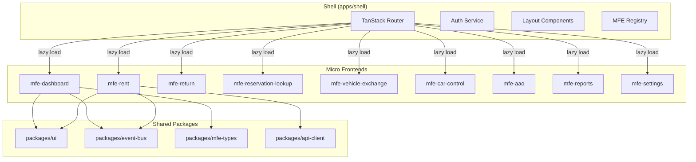
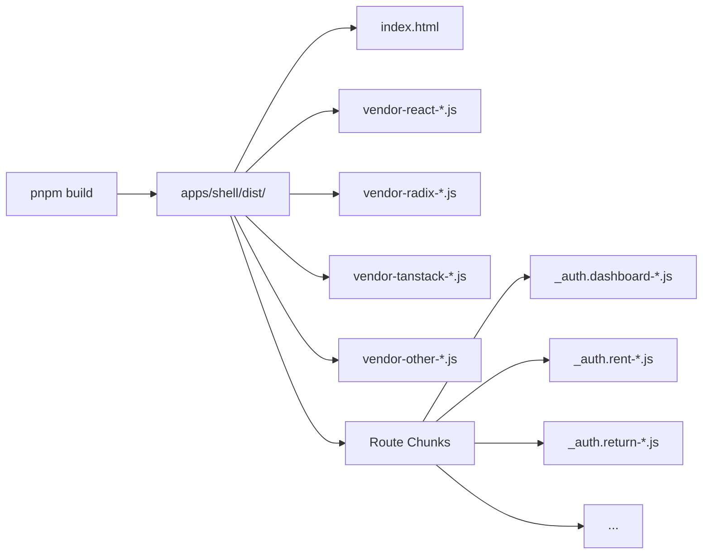
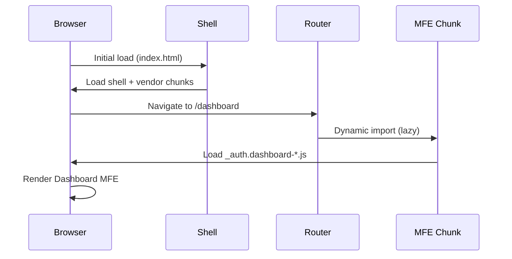

<objective>
Create comprehensive documentation for MFE architecture, contracts, and developer onboarding

Purpose: Enable new developers to understand the architecture, find contracts, and run the project without guidance. Documentation lives in the repo alongside code for version control.

Output: Updated ARCHITECTURE.md with MFE diagrams, new CONTRACTS.md with event/type docs, updated README.md with build/run instructions
</objective>

<execution_context>
@~/.claude/get-shit-done/workflows/execute-plan.md
@~/.claude/get-shit-done/templates/summary.md
</execution_context>

<context>
@.planning/PROJECT.md
@.planning/ROADMAP.md
@.planning/STATE.md
@.planning/phases/03-production-ready/03-RESEARCH.md

Existing ARCHITECTURE.md needs updating to reflect:
- New monorepo structure (apps/, packages/)
- MFE architecture with lazy loading
- Shell orchestration
- Docker deployment

Type contracts in packages/mfe-types/
Event bus in packages/event-bus/
</context>

<tasks>

<task type="auto">
  <name>Task 1: Update ARCHITECTURE.md with MFE structure</name>
  <files>ARCHITECTURE.md</files>
  <action>
Read existing ARCHITECTURE.md and update it to document the MFE architecture:

1. Keep useful existing content (tech rationale, testing strategy)

2. Add/update sections:

**Project Structure** - Add monorepo structure diagram:
```
new-dash-ui/
├── apps/
│   ├── shell/                 # Host application
│   │   ├── src/
│   │   │   ├── routes/        # TanStack Router routes (lazy load MFEs)
│   │   │   ├── services/      # Auth, MFE registry
│   │   │   └── layout/        # Sidebar, header, footer
│   │   ├── Dockerfile
│   │   └── vite.config.ts     # Bundle optimization
│   ├── mfe-dashboard/         # Dashboard MFE
│   ├── mfe-rent/              # Rent workflow MFE
│   ├── mfe-return/            # Return workflow MFE
│   ├── mfe-reservation-lookup/
│   ├── mfe-vehicle-exchange/
│   ├── mfe-car-control/
│   ├── mfe-aao/
│   ├── mfe-reports/
│   └── mfe-settings/
├── packages/
│   ├── ui/                    # Shared UI components
│   ├── api-client/            # React Query setup
│   ├── event-bus/             # Cross-MFE communication
│   └── mfe-types/             # Type contracts
├── docker/
│   └── nginx.conf             # Production server config
└── docker-compose.yml         # Local production demo
```

**MFE Architecture** - Add Mermaid diagram:


**Build Output** - Add diagram showing code splitting:


**Lazy Loading Flow** - Add sequence diagram:


3. Update existing diagrams to reflect new structure
4. Remove outdated sections that don't apply to MFE architecture
  </action>
  <verify>
- ARCHITECTURE.md contains monorepo structure
- Contains at least 3 Mermaid diagrams
- References apps/, packages/ structure
- Documents lazy loading pattern
  </verify>
  <done>ARCHITECTURE.md updated with comprehensive MFE documentation</done>
</task>

<task type="auto">
  <name>Task 2: Create CONTRACTS.md for event bus and types</name>
  <files>docs/CONTRACTS.md</files>
  <action>
Create docs/ directory and CONTRACTS.md:

1. mkdir -p docs

2. Create docs/CONTRACTS.md with:

**Event Bus Contracts** section:
- Document MfeEvent types from packages/event-bus
- Show subscription and emission examples
- List all event types with payloads

Read packages/event-bus/src/index.ts and packages/mfe-types/src/index.ts to extract actual types.

Example structure:
```markdown
# Contracts

## Event Bus

The event bus enables cross-MFE communication via typed events.

### Event Types

| Event | Payload | Emitted By | Consumed By |
|-------|---------|------------|-------------|
| navigation | { path: string } | Any MFE | Shell Router |
| data-refresh | { entity: string } | Rent/Return MFEs | Dashboard |
| notification | { type, message } | Any MFE | Shell |
| auth-state-changed | { isLoggedIn: boolean } | Shell Auth | All MFEs |

### Usage

```typescript
// Emit event
import { eventBus } from '@packages/event-bus';
eventBus.emit('data-refresh', { entity: 'reservations' });

// Subscribe
eventBus.on('data-refresh', (payload) => {
  // Refresh data...
});
```

## Type Contracts

### MFE Registry Types
(Document MfeMetadata, MfeRegistryState from mfe-types)

### Auth Service Interface
(Document AuthService interface from mfe-types)
```

Read the actual type files to document real interfaces.
  </action>
  <verify>
- docs/CONTRACTS.md exists
- Documents event bus events with payloads
- Documents shared type interfaces
- Includes code examples
  </verify>
  <done>CONTRACTS.md created with event bus and type documentation</done>
</task>

<task type="auto">
  <name>Task 3: Update README.md with quick start</name>
  <files>README.md</files>
  <action>
Replace the default Vite README with project-specific content:

```markdown
# Car Rental Dashboard (MFE Architecture)

A car rental management dashboard built with a build-time microfrontend architecture. 9 independently-owned MFEs compile into a single deploy artifact with route-based lazy loading.

## Quick Start

### Development

```bash
# Install dependencies
pnpm install

# Start dev server
pnpm dev

# Open http://localhost:5173
```

### Production (Docker)

```bash
# Build and run production container
docker-compose up --build

# Open http://localhost:8080
```

### Build Only

```bash
# Build all packages
pnpm build

# Output in apps/shell/dist/
```

## Architecture

See [ARCHITECTURE.md](./ARCHITECTURE.md) for full documentation.

### Project Structure

```
apps/
  shell/           # Host app with routing and layout
  mfe-*/           # 9 MFE packages (dashboard, rent, return, etc.)
packages/
  ui/              # Shared UI components
  api-client/      # React Query setup
  event-bus/       # Cross-MFE communication
  mfe-types/       # Type contracts
```

### Key Decisions

- **Build-time federation**: All MFEs compile together into single artifact
- **Route-based code splitting**: Each MFE loads on-demand via TanStack Router
- **Shared vendor chunks**: React, Radix UI, TanStack libraries deduplicated
- **Event bus communication**: Loose coupling between MFEs

## Development

### Adding a New MFE

1. Create package in `apps/mfe-{name}/`
2. Add route in `apps/shell/src/routes/_auth.{name}.tsx`
3. Export component from MFE package
4. Register in MFE registry

### Shared Packages

- `@packages/ui` - Reusable UI components (Button, Card, DataTable, etc.)
- `@packages/api-client` - React Query client and hooks
- `@packages/event-bus` - Typed event emitter for cross-MFE communication
- `@packages/mfe-types` - Shared TypeScript interfaces

See [docs/CONTRACTS.md](./docs/CONTRACTS.md) for event and type documentation.

## Scripts

| Command | Description |
|---------|-------------|
| `pnpm dev` | Start shell dev server |
| `pnpm build` | Build all packages |
| `pnpm typecheck` | Run TypeScript checks |
| `pnpm lint` | Run ESLint |

## Tech Stack

- React 19 with React Compiler
- TypeScript (strict mode)
- Vite 7 with Rollup
- TanStack Router (file-based routing)
- TanStack Query (server state)
- Zustand (client state)
- Radix UI + Tailwind CSS v4
- pnpm workspaces
```
  </action>
  <verify>
- README.md has project-specific content
- Contains Quick Start section with dev and docker commands
- Links to ARCHITECTURE.md and CONTRACTS.md
- Documents scripts and tech stack
  </verify>
  <done>README.md updated with comprehensive project documentation</done>
</task>

</tasks>

<verification>
After completing all tasks:

1. Documentation files exist:
   - ARCHITECTURE.md (updated)
   - docs/CONTRACTS.md (new)
   - README.md (updated)

2. Mermaid diagrams render:
   - View ARCHITECTURE.md in GitHub or VS Code preview
   - All diagrams should render without errors

3. Links work:
   - README links to ARCHITECTURE.md and docs/CONTRACTS.md
   - ARCHITECTURE.md references correct file paths

4. Content accurate:
   - Structure matches actual project layout
   - Events match packages/event-bus types
   - Types match packages/mfe-types definitions
</verification>

<success_criteria>
- ARCHITECTURE.md documents full MFE structure with working Mermaid diagrams
- docs/CONTRACTS.md documents event bus events and shared types with examples
- README.md contains quick start for dev and production
- New developer could understand architecture and run project from docs alone
</success_criteria>

<output>
After completion, create `.planning/phases/03-production-ready/03-03-SUMMARY.md`
</output>
