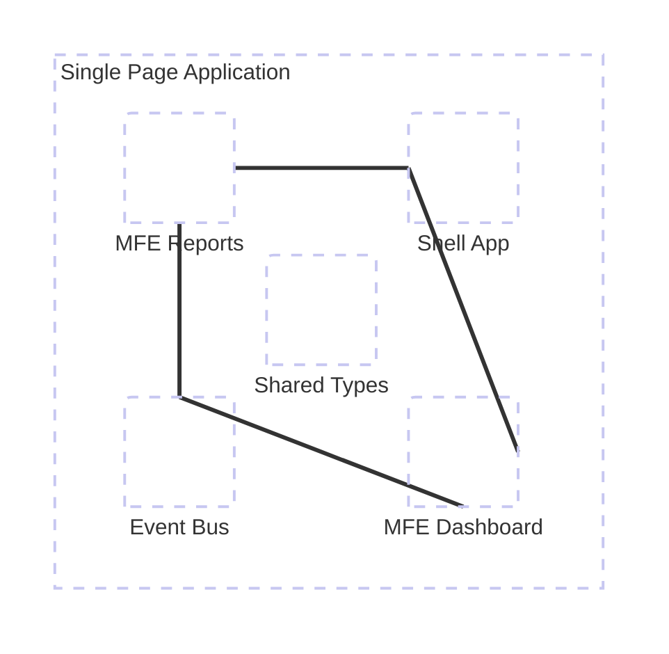
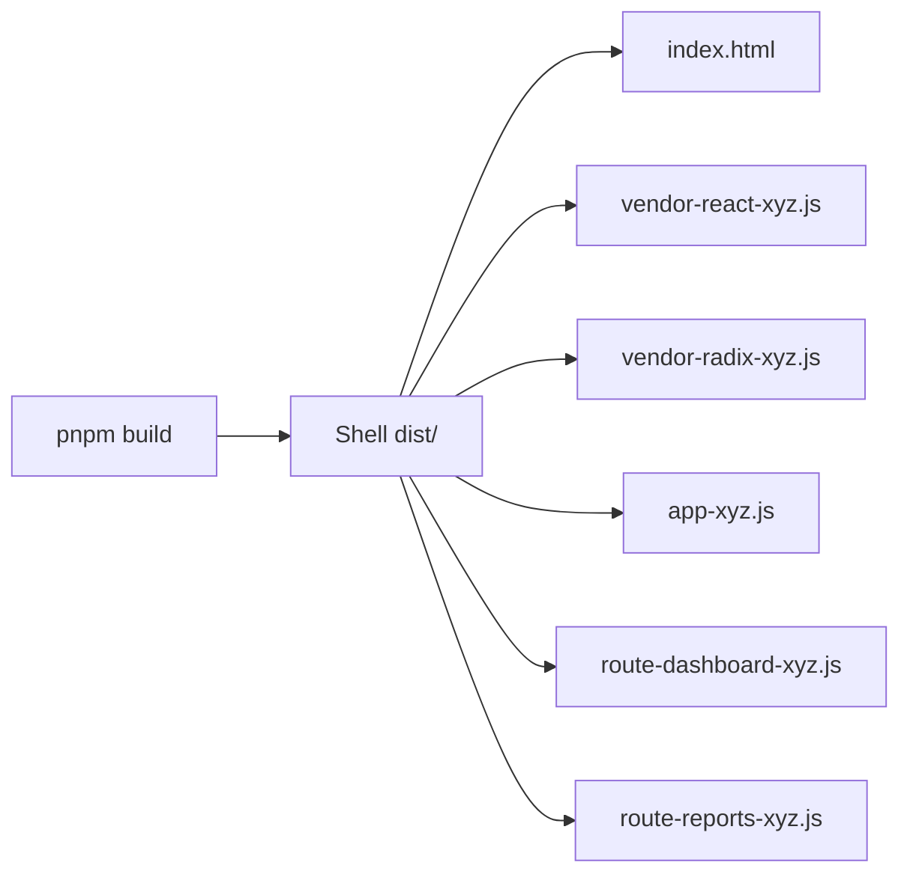

# Phase 3: Production Ready - Research

**Researched:** 2026-01-23
**Domain:** Vite build optimization, Docker/nginx production deployment, technical documentation
**Confidence:** HIGH

## Summary

Phase 3 focuses on three core domains: (1) Vite bundle optimization with code splitting and shared vendor chunks, (2) containerized production deployment with Docker and nginx, and (3) comprehensive architecture documentation for team onboarding.

The standard approach uses Vite's `build.rollupOptions.output.manualChunks` for granular control over code splitting, separating frequently-changing application code from stable vendor dependencies to maximize browser cache efficiency. For production deployment, multi-stage Docker builds compile Vite assets in a Node container then serve them via nginx Alpine, achieving 50MB images compared to 1GB+ single-stage builds. Documentation should live in the repository as Mermaid diagrams and markdown files, versioned alongside code changes.

**Primary recommendation:** Use function-based manualChunks to automatically group node_modules by package name, deploy via multi-stage Docker with nginx configured for SPA fallback routing and asset caching, and maintain architecture diagrams as Mermaid code in the repository.

## Standard Stack

The established libraries/tools for this domain:

### Core
| Library | Version | Purpose | Why Standard |
|---------|---------|---------|--------------|
| Vite | 7.2+ | Build tool with Rollup bundler | Native ESM, fast HMR, production-optimized builds with Rollup |
| rollup-plugin-visualizer | 6.0+ | Bundle size analysis | Interactive treemap visualization, source map support, multiple output formats |
| vite-plugin-bundlesize | latest | Bundle size enforcement | Fails builds when chunks exceed limits, glob patterns, compression-aware |
| nginx | alpine | Static file server | Lightweight, battle-tested, efficient static asset serving |
| Docker | latest | Containerization | Standard for production deployments, multi-stage builds |
| Mermaid.js | 11.1+ | Architecture diagrams | Diagram-as-code, version control friendly, GitHub/markdown native |

### Supporting
| Library | Version | Purpose | When to Use |
|---------|---------|---------|-------------|
| bundle-stats | latest | CI bundle monitoring | GitHub Actions integration, PR comments with size comparisons |
| vite-size-action | latest | GitHub Action for bundle size | Alternative to bundle-stats, simpler setup for basic needs |
| splitVendorChunkPlugin | built-in | Simple vendor splitting | Quick setup when advanced control not needed |

### Alternatives Considered
| Instead of | Could Use | Tradeoff |
|------------|-----------|----------|
| manualChunks function | splitVendorChunkPlugin | Plugin is simpler but less control, creates single vendor chunk |
| rollup-plugin-visualizer | vite-bundle-analyzer | Analyzer has different UI, visualizer more established |
| nginx | Caddy/Apache | nginx more standard for static files, lighter weight |

**Installation:**
```bash
pnpm add -D rollup-plugin-visualizer vite-plugin-bundlesize
```

## Architecture Patterns

### Recommended Project Structure
```
.
├── apps/
│   ├── shell/              # Shell app with routing
│   │   ├── vite.config.ts  # Bundle optimization config
│   │   └── Dockerfile      # Multi-stage build
│   └── mfe-*/              # Individual MFE apps
├── docker/
│   ├── nginx.conf          # SPA routing + caching
│   └── docker-compose.yml  # Orchestration
├── docs/
│   ├── ARCHITECTURE.md     # Mermaid diagrams
│   └── CONTRACTS.md        # Event bus + types
└── README.md               # Quick start guide
```

### Pattern 1: Function-Based manualChunks for MFE Monorepo
**What:** Automatically split vendor dependencies by package name, separate from app code
**When to use:** Always for production builds in monorepos with multiple apps
**Example:**
```typescript
// Source: https://soledadpenades.com/posts/2025/use-manual-chunks-with-vite-to-facilitate-dependency-caching/
// apps/shell/vite.config.ts
export default defineConfig({
  build: {
    rollupOptions: {
      output: {
        manualChunks: (id) => {
          // Extract vendor dependencies into separate chunks
          if (id.includes('node_modules')) {
            // Extract package name: node_modules/react-dom/index.js -> react-dom
            const parts = id.split('node_modules/')[1].split('/');
            const packageName = parts[0].startsWith('@')
              ? `${parts[0]}/${parts[1]}` // Scoped packages like @radix-ui/react-dialog
              : parts[0];

            // Group related packages for better caching
            if (packageName.startsWith('@radix-ui')) return 'vendor-radix';
            if (packageName === 'react' || packageName === 'react-dom') return 'vendor-react';
            if (packageName.startsWith('@tanstack')) return 'vendor-tanstack';

            return 'vendor-other';
          }

          // Application code goes to default chunk
          return 'app';
        }
      }
    }
  }
});
```

### Pattern 2: Multi-Stage Docker Build
**What:** Build stage compiles assets, production stage serves with nginx
**When to use:** Always for production deployments
**Example:**
```dockerfile
# Source: Multiple production guides from 2025-2026
# Stage 1: Build
FROM node:23-alpine AS builder
WORKDIR /app
COPY package*.json pnpm-lock.yaml ./
RUN corepack enable && pnpm install --frozen-lockfile
COPY . .
RUN pnpm build

# Stage 2: Production
FROM nginx:alpine
# Create non-root user
RUN addgroup -g 1001 -S nodejs && \
    adduser -S nextjs -u 1001
COPY --from=builder --chown=nodejs:nodejs /app/dist /usr/share/nginx/html
COPY docker/nginx.conf /etc/nginx/conf.d/default.conf
EXPOSE 80
USER nodejs
CMD ["nginx", "-g", "daemon off;"]
```

### Pattern 3: Nginx Configuration for SPA with Code Splitting
**What:** Serve static assets with long cache, fallback to index.html for routes, security headers
**When to use:** Always when serving SPAs with client-side routing
**Example:**
```nginx
# Source: https://github.com/it-wibrc/guide-containerizing-spa-nginx
server {
    listen 80;
    server_name _;
    root /usr/share/nginx/html;
    index index.html;

    # Security headers
    add_header X-Frame-Options "SAMEORIGIN" always;
    add_header X-Content-Type-Options "nosniff" always;
    add_header X-XSS-Protection "1; mode=block" always;

    # Code-split assets with content hash - long cache
    location ~* ^/assets/.+\.(js|css|png|jpg|jpeg|gif|ico|svg|woff|woff2|ttf|eot)$ {
        add_header Cache-Control "public, max-age=31536000, s-maxage=31536000, immutable";
        try_files $uri =404;
    }

    # index.html - no cache (always check for updates)
    location = /index.html {
        add_header Cache-Control "public, max-age=0, s-maxage=0, must-revalidate" always;
        try_files $uri =404;
    }

    # SPA fallback - all other routes go to index.html
    location / {
        try_files $uri $uri/ /index.html;
    }
}
```

### Pattern 4: Bundle Size Enforcement in Vite
**What:** Fail builds when chunks exceed size budgets
**When to use:** In CI/CD pipelines to prevent bundle bloat
**Example:**
```typescript
// Source: https://github.com/drwpow/vite-plugin-bundlesize
import bundlesize from 'vite-plugin-bundlesize';

export default defineConfig({
  plugins: [
    bundlesize({
      limits: [
        {
          pattern: 'dist/**/*.js',
          limit: '150 kB', // Default recommended limit
        },
        {
          pattern: 'dist/assets/vendor-react-*.js',
          limit: '200 kB', // React + React-DOM
        },
        {
          pattern: 'dist/assets/vendor-radix-*.js',
          limit: '250 kB', // Radix UI components
        },
      ],
      allowFail: false, // Fail build on violation
    }),
  ],
  build: {
    sourcemap: 'hidden', // Required for bundlesize plugin
    chunkSizeWarningLimit: 500, // Vite's built-in warning
  },
});
```

### Pattern 5: Mermaid Architecture Diagrams in Documentation
**What:** Store architecture diagrams as code in markdown files
**When to use:** For all architecture documentation
**Example:**
```markdown
<!-- Source: Mermaid.js v11.1+ architecture diagram syntax -->
# Architecture Overview

## System Context



## Build Output Structure


```

### Anti-Patterns to Avoid
- **Declaring lazy components inside other components:** Causes re-initialization on every render, breaks code splitting benefits
- **Single monolithic vendor chunk:** All dependencies in one file means changing any dependency invalidates entire cache
- **Overwriting nginx.conf instead of default.conf:** Docker nginx has both files, default.conf is correct location for custom config
- **Caching index.html:** Must have `max-age=0` or users won't get updates after deployments
- **Not handling lazy loading failures:** Network errors during chunk loading need Error Boundaries
- **Omitting VITE_ prefix on env vars:** Client-side code can only access import.meta.env.VITE_* variables

## Don't Hand-Roll

Problems that look simple but have existing solutions:

| Problem | Don't Build | Use Instead | Why |
|---------|-------------|-------------|-----|
| Bundle visualization | Custom JSON parser + UI | rollup-plugin-visualizer | Handles source maps, multiple formats (treemap/sunburst), compression size calculation |
| Bundle size enforcement | Git hooks + manual checks | vite-plugin-bundlesize | Glob patterns, compression modes, configurable limits, fails CI builds |
| CI bundle monitoring | Custom GitHub Actions scripts | bundle-stats or vite-size-action | Automated PR comments, historical tracking, comparison tables |
| Nginx SPA configuration | Custom routing logic | Standard try_files pattern | Battle-tested, handles edge cases (dots in routes, 404s), works with all routers |
| Docker layer caching | Single-stage builds | Multi-stage with separate deps | Rebuilds only changed layers, 95% smaller images (50MB vs 1GB+) |
| Architecture diagrams | PowerPoint/Draw.io | Mermaid in markdown | Version controlled, reviewable in PRs, renders in GitHub/docs sites |

**Key insight:** Production optimization has well-established patterns. Custom solutions miss edge cases (route handling), miss optimizations (Docker layers), and lack ecosystem integration (CI/CD). Use proven tools that handle the complexity.

## Common Pitfalls

### Pitfall 1: Environment Variables Not Prefixed with VITE_
**What goes wrong:** Variables work in development but are undefined in production build
**Why it happens:** Vite only exposes import.meta.env.VITE_* to client code for security
**How to avoid:** Prefix all client-side env vars with VITE_ (e.g., VITE_API_URL)
**Warning signs:** import.meta.env.API_URL returns undefined, works in dev mode but breaks in build

### Pitfall 2: Multiple nginx Config Files Override Each Other
**What goes wrong:** SPA routing doesn't work, 404 errors on client-side routes
**Why it happens:** Docker nginx loads both /etc/nginx/nginx.conf and /etc/nginx/conf.d/default.conf, wrong file gets priority
**How to avoid:** Copy custom config to /etc/nginx/conf.d/default.conf, not /etc/nginx/nginx.conf
**Warning signs:** Refreshing a route returns 404, deep links don't work

### Pitfall 3: All Static Assets Return index.html on 404
**What goes wrong:** Missing images/fonts/JS files serve index.html instead of 404, breaking the app
**Why it happens:** Overly broad try_files $uri $uri/ /index.html applies to all paths
**How to avoid:** Separate location blocks for /assets/ with try_files $uri =404, only fallback in location /
**Warning signs:** Network tab shows index.html content for .js/.css files, huge file sizes for assets

### Pitfall 4: Cached index.html Prevents Updates After Deploy
**What goes wrong:** Users don't see updates after deployment, old version persists
**Why it happens:** index.html cached with long max-age, browser never checks for updates
**How to avoid:** Set Cache-Control "max-age=0, must-revalidate" for index.html, long cache only for hashed assets
**Warning signs:** Deploy completes but users report old UI, hard refresh fixes it

### Pitfall 5: React.lazy Only Supports Default Exports
**What goes wrong:** import { Component } from './file' with lazy() throws error
**Why it happens:** React.lazy() requires default export, named exports not supported
**How to avoid:** Use default exports for lazy components, or create intermediate module that re-exports as default
**Warning signs:** "Element type is invalid" error, works without lazy() but breaks with it

### Pitfall 6: No Error Boundaries for Lazy Loading Failures
**What goes wrong:** Network errors during chunk loading crash entire app with white screen
**Why it happens:** Dynamic imports can fail (network issues, missing chunks), uncaught errors bubble up
**How to avoid:** Wrap lazy components with Error Boundary at route level, provide retry mechanism
**Warning signs:** ChunkLoadError in production, app works on good network but fails on poor connectivity

### Pitfall 7: Development vs Production Mode Confusion
**What goes wrong:** vite build --mode development still creates production build, uses wrong env file
**Why it happens:** Vite's "mode" concept differs from NODE_ENV, mode selects .env file but doesn't control build optimization
**How to avoid:** Use mode for env file selection, rely on command (vite vs vite build) for dev/prod behavior
**Warning signs:** Wrong environment variables loaded, build is minified when expecting readable code

### Pitfall 8: Manual Chunks Trigger Side Effects Out of Order
**What goes wrong:** Global initialization code runs before dependencies loaded, causing runtime errors
**Why it happens:** Code splitting changes module execution order, side effects in module scope execute immediately
**How to avoid:** Avoid side effects in module scope, use explicit initialization functions, test production build locally
**Warning signs:** "X is not defined" errors in production only, works in dev mode

## Code Examples

Verified patterns from official sources:

### Docker Compose for Local Production Testing
```yaml
# Source: Production deployment guides 2025-2026
version: '3.8'

services:
  web:
    build:
      context: .
      dockerfile: apps/shell/Dockerfile
    ports:
      - "8080:80"
    environment:
      - NODE_ENV=production
    healthcheck:
      test: ["CMD", "curl", "-f", "http://localhost:80"]
      interval: 30s
      timeout: 10s
      retries: 3
```

### Bundle Analysis Visualization
```typescript
// Source: https://github.com/btd/rollup-plugin-visualizer
import { visualizer } from 'rollup-plugin-visualizer';

export default defineConfig({
  plugins: [
    visualizer({
      open: true, // Auto-open in browser after build
      filename: 'dist/stats.html',
      gzipSize: true,
      brotliSize: true,
      template: 'treemap', // 'sunburst' | 'network' | 'treemap'
    }),
  ],
});
```

### GitHub Actions Bundle Size Monitoring
```yaml
# Source: https://github.com/marketplace/actions/vite-compare-bundle-size
name: Bundle Size Check

on:
  pull_request:
    branches: [main]

jobs:
  bundle-size:
    runs-on: ubuntu-latest
    steps:
      - uses: actions/checkout@v4
      - uses: actions/setup-node@v4
        with:
          node-version: '20'
      - run: corepack enable
      - run: pnpm install --frozen-lockfile
      - run: pnpm build
      - uses: github/bundle-size-diff@v1
        with:
          path: 'apps/shell/dist/**/*.js'
```

### Handling Named Exports with React.lazy
```typescript
// Source: https://react.dev/reference/react/lazy
// ❌ WRONG - React.lazy doesn't support named exports
const Dashboard = lazy(() => import('./Dashboard').then(m => m.Dashboard));

// ✅ CORRECT - Create intermediate module
// Dashboard.lazy.tsx
export { default } from './Dashboard';

// App.tsx
const Dashboard = lazy(() => import('./Dashboard.lazy'));
```

### Error Boundary for Lazy Loading
```typescript
// Source: React documentation + production best practices
class LazyLoadErrorBoundary extends React.Component {
  state = { hasError: false };

  static getDerivedStateFromError(error: Error) {
    // Check if it's a chunk loading error
    if (error.name === 'ChunkLoadError') {
      return { hasError: true };
    }
    throw error; // Re-throw other errors
  }

  render() {
    if (this.state.hasError) {
      return (
        <div>
          <h2>Failed to load page</h2>
          <button onClick={() => window.location.reload()}>
            Retry
          </button>
        </div>
      );
    }
    return this.props.children;
  }
}

// Usage
<LazyLoadErrorBoundary>
  <Suspense fallback={<Loading />}>
    <LazyRoute />
  </Suspense>
</LazyLoadErrorBoundary>
```

## State of the Art

| Old Approach | Current Approach | When Changed | Impact |
|--------------|------------------|--------------|--------|
| Single vendor.js chunk | Package-based vendor chunks | Vite 2.9 (2022) | Better caching granularity, smaller updates |
| Default vendor splitting | Manual configuration required | Vite 2.9 (2022) | splitVendorChunkPlugin or manualChunks needed |
| 1GB+ Docker images | Multi-stage builds ~50MB | Docker best practices | 95% size reduction, faster deployments |
| Static diagram files | Mermaid diagram-as-code | Mermaid 11.1+ (2024) | Version controlled, reviewable in PRs |
| webpack-bundle-analyzer | rollup-plugin-visualizer | Vite ecosystem | Native Rollup integration, better performance |

**Deprecated/outdated:**
- **splitVendorChunk build option (Vite 2.9+):** Removed from default config, use splitVendorChunkPlugin or manualChunks
- **build.manifest: true for MPA:** Still works but manualChunks provides better control for modern apps
- **Running nginx as root in Docker:** Security best practice is non-root user with high ports (>1024)

## Open Questions

Things that couldn't be fully resolved:

1. **Optimal chunk size thresholds for MFE architecture**
   - What we know: vite-plugin-bundlesize defaults to 150 kB, Vite warns at 500 kB
   - What's unclear: Whether MFE apps should use different thresholds than traditional SPAs
   - Recommendation: Start with 150 kB default, measure actual chunk sizes after implementing manualChunks, adjust based on cache hit rates

2. **Bundle size monitoring in monorepo with multiple apps**
   - What we know: bundle-stats and vite-size-action track single app bundles
   - What's unclear: How to track multiple app bundles in PR comments without clutter
   - Recommendation: Run bundle monitoring for shell app only (contains all dependencies), spot-check individual MFEs manually

3. **Preloading strategy for lazy-loaded MFE routes**
   - What we know: TanStack Router supports route preloading, Vite generates modulepreload directives
   - What's unclear: Whether to preload next-likely-route MFEs or only load on navigation
   - Recommendation: Start with on-demand loading, add preloading if navigation feels slow (measure with Core Web Vitals)

## Sources

### Primary (HIGH confidence)
- Vite Official Docs - Build Options: https://vite.dev/config/build-options
- Vite Official Docs - Features: https://vite.dev/guide/features
- Rollup Official Docs - manualChunks: https://rollupjs.org/configuration-options/#output-manualchunks
- React Official Docs - lazy: https://react.dev/reference/react/lazy
- vite-plugin-bundlesize GitHub: https://github.com/drwpow/vite-plugin-bundlesize
- rollup-plugin-visualizer GitHub: https://github.com/btd/rollup-plugin-visualizer
- Mermaid.js Architecture Diagrams: https://mermaid.js.org/syntax/architecture.html

### Secondary (MEDIUM confidence)
- Manual Chunks with Vite (2025): https://soledadpenades.com/posts/2025/use-manual-chunks-with-vite-to-facilitate-dependency-caching/
- Vite Bundle Optimization in Micro-Frontend: https://medium.com/@contact.francescodone/vite-bundle-optimization-f200a8e475be
- Production Docker Container for Vite + React: https://alvincrespo.hashnode.dev/react-vite-production-ready-docker
- Containerizing Modern SPA with Multi-Stage Nginx: https://dev.to/it-wibrc/guide-to-containerizing-a-modern-javascript-spa-vuevitereact-with-a-multi-stage-nginx-build-1lma
- React Vite + Docker + Nginx Deployment: https://www.buildwithmatija.com/blog/production-react-vite-docker-deployment
- Mastering Nginx History Mode for SPA: https://apipark.com/techblog/en/mastering-nginx-history-mode-for-spa-deployment/
- Nginx + SPA Routing: https://www.andrew-best.com/posts/lightning-post-nginx-spa-routing-fun-times/
- Developer Onboarding Documentation: https://www.idaszak.com/posts/developer-onboarding-documentation/
- System Architecture Documentation Best Practices: https://www.freecodecamp.org/news/system-architecture-documentation-best-practices-and-tools/

### Tertiary (LOW confidence)
- Various Medium articles on bundle optimization and micro-frontend patterns (used for cross-validation only)
- Community discussions on GitHub and DEV.to (validated against official sources)

## Metadata

**Confidence breakdown:**
- Standard stack: HIGH - All tools verified against official docs and npm registries
- Architecture patterns: HIGH - manualChunks, Docker multi-stage, nginx config verified with official sources
- Pitfalls: HIGH - Common issues documented in official troubleshooting guides and production articles from 2025-2026
- Documentation: MEDIUM - Mermaid architecture diagrams are beta (v11.1+), but core diagramming is stable

**Research date:** 2026-01-23
**Valid until:** 2026-02-23 (30 days - stable domain, infrequent breaking changes)
