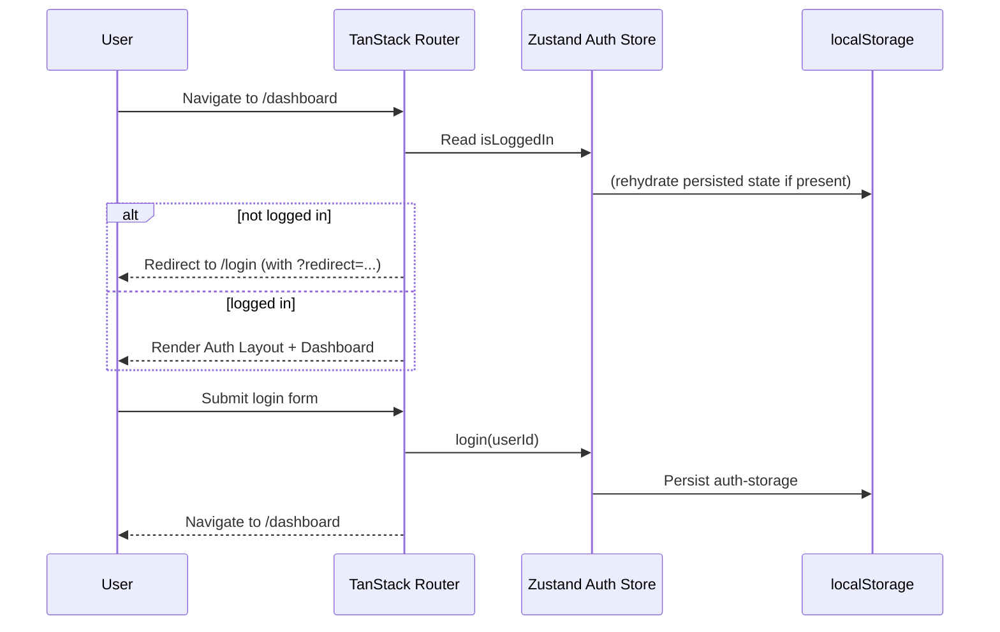

# Architecture (new-dash-ui)

## 1) Purpose / scope

This repository is a **single-page application (SPA)** for a dashboard-style UI.
It is currently a **frontend-only** project (no backend API client layer has been introduced yet).

The primary goals of the current architecture are:

- fast local development & builds
- type-safe routing and navigation
- consistent, accessible UI primitives with a design system approach
- a small, explicit state layer for cross-cutting concerns (auth)

---

## 2) Technologies / language / framework used (and rationale)

### Runtime / language

- **TypeScript**
  - Used across the app for end-to-end type safety and refactorability.
  - Configured in strict mode (see [`tsconfig.app.json`](tsconfig.app.json:1)).

- **React 19**
  - Component-based UI architecture with a broad ecosystem.
  - The project enables the React Compiler via Babel for performance-oriented optimizations (see [`vite.config.ts`](vite.config.ts:1)).

### Tooling: build, dev server, bundling

- **Vite**
  - Modern dev server and bundler with fast HMR and a minimal config surface.
  - See scripts in [`package.json`](package.json:1) and config in [`vite.config.ts`](vite.config.ts:1).

- **Progressive Web App (PWA) via `vite-plugin-pwa`**
  - Generates and registers a service worker + web app manifest for installability and offline-friendly behavior.
  - Service worker registration is done in [`src/main.tsx`](src/main.tsx:1) via `virtual:pwa-register`.
  - Install UX is handled in-app via [`src/hooks/usePWAInstall.ts`](src/hooks/usePWAInstall.ts:1) + [`src/components/PWAInstallBanner.tsx`](src/components/PWAInstallBanner.tsx:1).
  - Configured in [`vite.config.ts`](vite.config.ts:1) (manifest, assets, `registerType`, dev options).

- **React Compiler (Babel plugin)**
  - Enabled through `babel-plugin-react-compiler` to allow compilation-time optimization of React components.
  - Configured through Vite’s React plugin (see [`vite.config.ts`](vite.config.ts:10)).

### Routing

- **TanStack Router**
  - Strong TypeScript support, route-level data loading hooks, and explicit control via `beforeLoad` guards.
  - The project uses **file-based routing** through the Vite plugin, which generates [`src/routeTree.gen.ts`](src/routeTree.gen.ts:1) from route modules in [`src/routes/`](src/routes/__root.tsx:1).
  - Router created in [`src/main.tsx`](src/main.tsx:8).

**Rationale:** type-safe routes and route guards are especially useful for authenticated layouts, redirects, and scalable route trees.

### State management

- **Zustand** (+ `persist` middleware)
  - Lightweight global state for cross-cutting concerns without heavy ceremony.
  - Used for auth state persistence in localStorage under the key `auth-storage` (see [`src/store/useAuthStore.ts`](src/store/useAuthStore.ts:1)).

**Rationale:** the current app needs only a small global store (login state + user id), making Zustand a good fit.

### Styling / UI system

- **Tailwind CSS v4**
  - Utility-first styling enabling rapid iteration and consistent spacing/typography.
  - Tailwind is integrated via the Vite plugin (see [`vite.config.ts`](vite.config.ts:3)) and imported in [`src/index.css`](src/index.css:1).
  - The app defines design tokens (colors/radii) using Tailwind v4’s `@theme` (see [`src/index.css`](src/index.css:3)).

- **Radix UI primitives**
  - Accessible unstyled components used as building blocks (e.g., collapsible, dropdown menu, separator).
  - Dependencies are listed in [`package.json`](package.json:12).

- **“shadcn/ui-style” component approach** (local UI components)
  - The codebase contains reusable UI wrappers in [`src/components/ui/`](src/components/ui/button.tsx:1).
  - Uses `class-variance-authority` (CVA) + `clsx` + `tailwind-merge` to build variant-based components.
  - The `cn()` helper lives in [`src/lib/utils.ts`](src/lib/utils.ts:4).

**Rationale:** Tailwind + Radix + local wrapper components provide an efficient design system pattern with strong accessibility and consistent styling.

### Icons

- **lucide-react**
  - Consistent icon set used across pages and navigation (see usage in [`src/components/Sidebar.tsx`](src/components/Sidebar.tsx:1)).

### Forms & Validation

- **React Hook Form** for performant form state management and submission handling.
- **Zod** for schema-driven validation and TypeScript type inference.
- Integrated using `@hookform/resolvers/zod`, keeping validation logic outside UI components.

**Rationale:** This approach enforces separation of concerns, strong type safety, and consistent validation across forms.

### Quality / correctness

- **ESLint**
  - Base linting for TypeScript/React hooks and React Refresh expectations (see [`eslint.config.js`](eslint.config.js:1)).

- **TypeScript project references**
  - Split app vs node (Vite config) compiler options (see [`tsconfig.json`](tsconfig.json:1), [`tsconfig.app.json`](tsconfig.app.json:1), [`tsconfig.node.json`](tsconfig.node.json:1)).

### Testing (current state + recommended approach)

**Current state:** the repo includes unit/component testing dependencies (Vitest + jsdom + React Testing Library) and provides npm scripts for running them (see [`package.json`](package.json:1)).

- Unit/component tests: `npm run test`, `npm run test:watch`, `npm run test:ui`, `npm run test:coverage`
- E2E tests: `npm run test:e2e`, `npm run test:e2e:ui` (Playwright)

> Note: Playwright typically requires a one-time browser install step (`npx playwright install`) in CI/dev environments.

**Recommended layered test strategy (when tests are introduced):**

1) **Unit tests (pure functions, utilities)**
   - Target: helpers like [`cn()`](src/lib/utils.ts:4) and any future domain logic.
   - Suggested tooling: **Vitest** (fits naturally with Vite).

2) **Component tests (render + behavior)**
   - Target: reusable UI components under [`src/components/ui/`](src/components/ui/button.tsx:1) and composed components like [`Sidebar`](src/components/Sidebar.tsx:220).
   - Suggested tooling: **React Testing Library** + **@testing-library/jest-dom** assertions.
   - Guideline: test user-observable behavior and accessibility roles/labels rather than implementation details.

3) **Route/auth flow tests (integration-level)**
   - Target: route guards and redirects defined via `beforeLoad` (e.g. unauthenticated access to the authenticated layout in [`src/routes/_auth.tsx`](src/routes/_auth.tsx:9)).
   - Suggested approach: render the app router and simulate navigation with a controlled auth store state.
   - Mocking: if/when API calls exist, prefer **MSW** for request mocking.

4) **End-to-end tests (critical user journeys)**
   - Target: login → dashboard navigation, sidebar interactions, and critical task flows.
   - Suggested tooling: **Playwright** (fast, reliable cross-browser automation).
   - Guideline: keep E2E small and focused on high-value scenarios.

**Proposed conventions (when added):**

- Place unit/component tests alongside code (e.g. `Button.test.tsx`) or under `src/__tests__/` (choose one and stay consistent).
- Add scripts to [`package.json`](package.json:1), such as `test`, `test:watch`, `test:ui`, `test:e2e`.

---

## 3) Overall architecture

### 3.1 High-level view

At runtime, the system is a browser-delivered React SPA:

- [`index.html`](index.html:1) loads the Vite-built bundle.
- [`src/main.tsx`](src/main.tsx:1) creates the router, injects auth into router context, and mounts the React app.
- TanStack Router matches routes defined in [`src/routes/`](src/routes/__root.tsx:1) and renders layouts/pages.
- Global auth state lives in Zustand and is persisted to localStorage.
- UI is composed from reusable components (`src/components/ui`) + domain components (e.g. [`src/components/Sidebar.tsx`](src/components/Sidebar.tsx:1)).

### 3.2 Key architectural building blocks

#### Routing layer (navigation + guards)

- Router instance is created in [`src/main.tsx`](src/main.tsx:8) with `routeTree` from [`src/routeTree.gen.ts`](src/routeTree.gen.ts:116).
- Route modules live under [`src/routes/`](src/routes/__root.tsx:1).
- `/` redirects to `/dashboard` (see [`src/routes/index.tsx`](src/routes/index.tsx:1)).
- `/login` prevents access when already authenticated via `beforeLoad` redirect (see [`src/routes/login.tsx`](src/routes/login.tsx:6)).
- `/_auth` is the authenticated layout route and blocks unauthenticated access via `beforeLoad` (see [`src/routes/_auth.tsx`](src/routes/_auth.tsx:9)).
- `/dashboard` is nested under the authenticated layout (see [`src/routes/_auth.dashboard.tsx`](src/routes/_auth.dashboard.tsx:4)).

Auth is passed into router context from the store:

- Zustand state → `context.auth.isLoggedIn` in [`src/main.tsx`](src/main.tsx:21)
- Route guards check `context.auth.isLoggedIn` in `beforeLoad`.

#### State layer (auth)

- Auth state is stored in Zustand and persisted using `zustand/middleware` (see [`src/store/useAuthStore.ts`](src/store/useAuthStore.ts:1)).
- Login flow (current behavior):
  - user submits login form in [`src/pages/LoginPage.tsx`](src/pages/LoginPage.tsx:10)
  - store `login(userId)` is called
  - user is navigated to `/dashboard`

> Note: The current login implementation is UI-only (no credential validation against a backend). This is a deliberate placeholder that keeps the routing/state architecture ready for a real auth integration.

#### Presentation layer (pages + components)

- Pages are in [`src/pages/`](src/pages/DashboardPage.tsx:1).
- Reusable UI primitives are in [`src/components/ui/`](src/components/ui/button.tsx:1).
- The authenticated layout composes navigation + header + routed content using `<Outlet />` (see [`src/routes/_auth.tsx`](src/routes/_auth.tsx:23)).

#### Styling layer

- Design tokens and global styles live in [`src/index.css`](src/index.css:1).
- Components use Tailwind utility classes and variant patterns.

#### PWA layer (service worker + install UX)

- **Service worker generation**
  - Driven by `vite-plugin-pwa` (see [`vite.config.ts`](vite.config.ts:1)).
  - Uses `registerType: "autoUpdate"` to keep the installed app up-to-date with new deployments.
  - Dev mode enables the service worker so the app can become “installable” while running `vite dev` (see `devOptions.enabled` in [`vite.config.ts`](vite.config.ts:1)).
  - Generated artifacts are emitted by the build tooling (e.g. `dist/sw.js` in production builds; dev output can appear under `dev-dist/` such as [`dev-dist/sw.js`](dev-dist/sw.js:1)).

- **Service worker registration**
  - Registered at startup in [`src/main.tsx`](src/main.tsx:1) via:
    - `registerSW({ immediate: true })` which registers as early as possible to let installability criteria be met.

- **Install prompt + banner**
  - [`src/hooks/usePWAInstall.ts`](src/hooks/usePWAInstall.ts:1) captures `beforeinstallprompt`, defers the native prompt, and tracks install state.
  - Dismissal is persisted in localStorage under `pwa-install-dismissed`.
  - [`src/components/PWAInstallBanner.tsx`](src/components/PWAInstallBanner.tsx:1) renders a bottom banner and calls `install()` to show the native install prompt.
  - The banner is mounted globally from the root route so it can appear on any page (see [`src/routes/__root.tsx`](src/routes/__root.tsx:1)).

- **Manifest / icons**
  - The web app manifest is defined inline in [`vite.config.ts`](vite.config.ts:1) (name, colors, `display: "standalone"`, icons).
  - The configured icon paths (e.g. `/pwa-192x192.png`, `/pwa-512x512.png`) must exist at the app’s public root at build time.

---

## 4) High-level diagram

### 4.1 Static/module architecture diagram

```mermaid
flowchart TB
  Browser[Browser]
  IndexHTML[index.html]
  Main[src/main.tsx\ncreateRouter + RouterProvider]
  SW[(Service Worker\nvite-plugin-pwa / Workbox)]
  Cache[(Cache Storage\n(precache/runtime caching))]
  RouteTree[src/routeTree.gen.ts\nGenerated route tree]
  Routes[src/routes/*\nRoute modules + guards]
  Pages[src/pages/*\nScreen-level components]
  UI[src/components/ui/*\nReusable UI primitives]
  Components[src/components/*\nDomain components (Sidebar)]
  Store[src/store/useAuthStore.ts\nZustand + persist]
  CSS[src/index.css\nTailwind v4 + theme]
  LocalStorage[(localStorage\nauth-storage)]

  Browser --> IndexHTML --> Main
  Browser <--> SW
  SW <--> Cache
  Main --> RouteTree
  RouteTree --> Routes
  Routes --> Pages
  Pages --> UI
  Pages --> Components
  Components --> UI

  Main --> Store
  Store <--> LocalStorage
  Pages --> Store
  UI --> CSS
  Pages --> CSS
  Components --> CSS
```

### 4.2 Authenticated navigation flow (runtime)



---

## 5) Current constraints / assumptions

- No API layer yet (no `fetch`/axios service modules, no query caching library).
- Auth is currently a client-side flag persisted to localStorage.
- The architecture intentionally places auth checks in route guards (`beforeLoad`) to keep “page access rules” near routing.
- No test framework is currently wired into the repo; the testing section above documents the intended direction.

---

## 6) Extension points (expected evolution)

- Introduce an API client module under `src/lib/` (e.g., `src/lib/api/*`) and potentially add request-level auth handling.
- Replace the placeholder login with a backend-driven auth flow (token storage, refresh, logout).
- Add route-level loaders/actions in TanStack Router for data fetching, co-located with routes.
- Add a server state library (e.g., TanStack Query) if/when the UI becomes data-heavy.
