# Architecture (new-dash-ui)

## 1) Purpose / scope

This repository is a **micro-frontend application** for a dashboard-style UI serving Hertz vehicle rental operations.
It uses a **build-time composition** approach where independent micro-frontends are composed into a unified shell application.

The primary goals of the current architecture are:

- fast local development & builds with Turborepo caching
- type-safe routing and navigation
- consistent, accessible UI primitives with a design system approach
- a small, explicit state layer for cross-cutting concerns (auth)
- team autonomy through domain-driven micro-frontend boundaries
- single deployment artifact for simplified operations

---

## 2) Technologies / language / framework used (and rationale)

### Runtime / language

- **TypeScript**
  - Used across the app for end-to-end type safety and refactorability.
  - Configured in strict mode with shared base config (see [`tsconfig.base.json`](tsconfig.base.json:1)).

- **React 19**
  - Component-based UI architecture with a broad ecosystem.
  - The project enables the React Compiler via Babel for performance-oriented optimizations.

### Monorepo & Build Orchestration

- **pnpm Workspaces**
  - Efficient disk usage through content-addressable storage.
  - Strict dependency resolution preventing phantom dependencies.
  - Workspace protocol (`workspace:*`) for internal package references.
  - See configuration in [`pnpm-workspace.yaml`](pnpm-workspace.yaml:1).

- **Turborepo**
  - Incremental build system with intelligent caching.
  - Parallel task execution respecting dependency graph.
  - Remote caching support for CI/CD optimization.
  - See configuration in [`turbo.json`](turbo.json:1).

### Tooling: build, dev server, bundling

- **Vite**
  - Modern dev server and bundler with fast HMR and a minimal config surface.
  - See scripts in [`apps/shell/package.json`](apps/shell/package.json:1) and config in [`apps/shell/vite.config.ts`](apps/shell/vite.config.ts:1).

- **Progressive Web App (PWA) via `vite-plugin-pwa`**
  - Generates and registers a service worker + web app manifest for installability and offline-friendly behavior.
  - Service worker registration is done in [`apps/shell/src/main.tsx`](apps/shell/src/main.tsx:1) via `virtual:pwa-register`.

- **React Compiler (Babel plugin)**
  - Enabled through `babel-plugin-react-compiler` to allow compilation-time optimization of React components.

### Routing

- **TanStack Router**
  - Strong TypeScript support, route-level data loading hooks, and explicit control via `beforeLoad` guards.
  - The project uses **file-based routing** through the Vite plugin, which generates route trees from route modules in [`apps/shell/src/routes/`](apps/shell/src/routes/__root.tsx:1).

**Rationale:** type-safe routes and route guards are especially useful for authenticated layouts, redirects, and scalable route trees.

### State management

- **Zustand** (+ `persist` middleware)
  - Lightweight global state for cross-cutting concerns without heavy ceremony.
  - Used for auth state persistence in localStorage under the key `auth-storage` (see [`packages/shared-state/src/auth-store.ts`](packages/shared-state/src/auth-store.ts:1)).

**Rationale:** the current app needs only a small global store (login state + user id), making Zustand a good fit.

### Styling / UI system

- **Tailwind CSS v4**
  - Utility-first styling enabling rapid iteration and consistent spacing/typography.
  - Tailwind is integrated via the Vite plugin and imported in [`apps/shell/src/index.css`](apps/shell/src/index.css:1).

- **Radix UI primitives**
  - Accessible unstyled components used as building blocks (e.g., collapsible, dropdown menu, separator, dialog).

- **"shadcn/ui-style" component approach** (shared UI package)
  - The codebase contains reusable UI wrappers in [`packages/shared-ui/src/`](packages/shared-ui/src/index.ts:1).
  - Uses `class-variance-authority` (CVA) + `clsx` + `tailwind-merge` to build variant-based components.
  - The `cn()` helper lives in [`packages/shared-utils/src/cn.ts`](packages/shared-utils/src/cn.ts:1).

### Forms & Validation

- **React Hook Form** for performant form state management and submission handling.
- **Zod** for schema-driven validation and TypeScript type inference.
- Integrated using `@hookform/resolvers/zod`, keeping validation logic outside UI components.

### Server State & Data Fetching

- **TanStack Query** (React Query) for server-state management, caching, and background synchronization.
- Feature-based query and mutation hooks to keep data-fetching logic out of UI components.
- Centralized QueryClient in shared-state package for global defaults.
- Shared query key definitions in [`packages/shared-state/src/query-keys.ts`](packages/shared-state/src/query-keys.ts:1).

### Quality / correctness

- **ESLint**
  - Base linting for TypeScript/React hooks and React Refresh expectations.

- **TypeScript path aliases**
  - Configured in shell's tsconfig for seamless package imports.

### Testing

- Unit/component tests: Vitest + jsdom + React Testing Library
- E2E tests: Playwright

---

## 3) Overall architecture

### 3.1 High-level view

At runtime, the system is a browser-delivered React SPA composed from multiple micro-frontend packages:

- [`apps/shell/index.html`](apps/shell/index.html:1) loads the Vite-built bundle.
- [`apps/shell/src/main.tsx`](apps/shell/src/main.tsx:1) creates the router, registers MFEs, and mounts the React app.
- TanStack Router matches routes and renders layouts/pages.
- MFE packages contribute navigation, dialogs, and page components.
- Global auth state lives in Zustand (shared-state package) and is persisted to localStorage.
- UI is composed from shared-ui components + domain components from MFE packages.

### 3.2 Key architectural building blocks

#### Routing layer (navigation + guards)

- Router instance is created in [`apps/shell/src/main.tsx`](apps/shell/src/main.tsx:1).
- Route modules live under [`apps/shell/src/routes/`](apps/shell/src/routes/__root.tsx:1).
- Routes import page components from MFE packages.
- Auth guards use shared-state's auth store.

#### State layer (auth)

- Auth state is stored in Zustand and persisted using `zustand/middleware`.
- Located in [`packages/shared-state/src/auth-store.ts`](packages/shared-state/src/auth-store.ts:1).
- Shared across all MFEs through package imports.

#### Presentation layer (pages + components)

- Pages are distributed across MFE packages (e.g., `mfe-rentals`, `mfe-returns`).
- Reusable UI primitives are in [`packages/shared-ui/src/`](packages/shared-ui/src/index.ts:1).
- The authenticated layout composes navigation + header + routed content.

#### Styling layer

- Design tokens and global styles live in [`apps/shell/src/index.css`](apps/shell/src/index.css:1).
- Components use Tailwind utility classes and variant patterns.

---

## 4) Micro-Frontend Architecture

### 4.1 Architecture Overview

This project implements a **build-time micro-frontend composition** pattern. Unlike runtime module federation, all MFEs are bundled together at build time into a single optimized artifact.

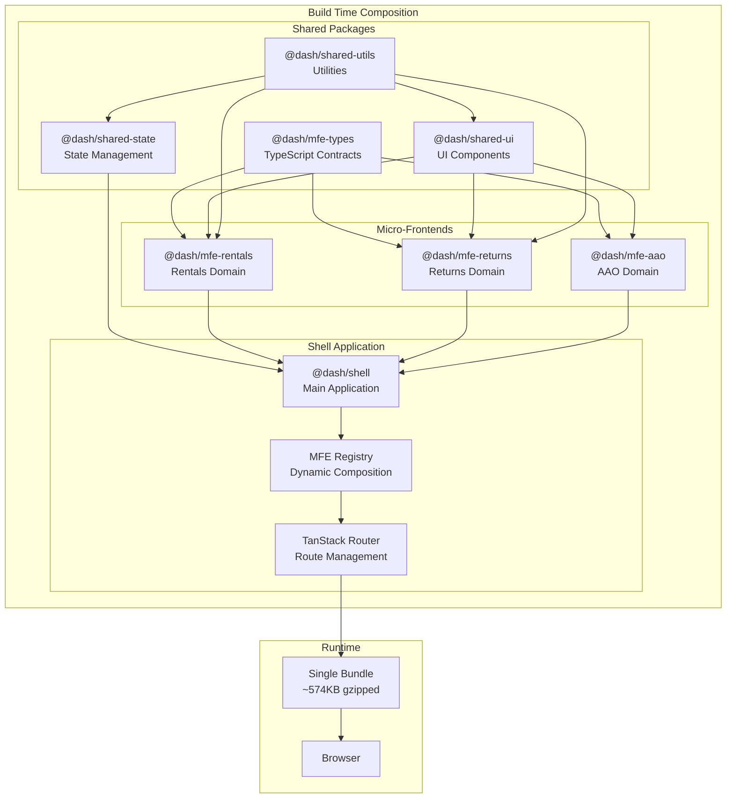
```mermaid
flowchart TB
    subgraph "Build Time Composition"
        direction TB

        subgraph "Shared Packages"
            MFE_TYPES["@dash/mfe-types<br/>TypeScript Contracts"]
            SHARED_UI["@dash/shared-ui<br/>UI Components"]
            SHARED_UTILS["@dash/shared-utils<br/>Utilities"]
            SHARED_STATE["@dash/shared-state<br/>State Management"]
        end

        subgraph "Micro-Frontends"
            MFE_RENTALS["@dash/mfe-rentals<br/>Rentals Domain"]
            MFE_RETURNS["@dash/mfe-returns<br/>Returns Domain"]
            MFE_AAO["@dash/mfe-aao<br/>AAO Domain"]
        end

        subgraph "Shell Application"
            SHELL["@dash/shell<br/>Main Application"]
            REGISTRY["MFE Registry<br/>Dynamic Composition"]
            ROUTER["TanStack Router<br/>Route Management"]
        end

        MFE_TYPES --> MFE_RENTALS
        MFE_TYPES --> MFE_RETURNS
        MFE_TYPES --> MFE_AAO

        SHARED_UI --> MFE_RENTALS
        SHARED_UI --> MFE_RETURNS
        SHARED_UI --> MFE_AAO

        SHARED_UTILS --> SHARED_UI
        SHARED_UTILS --> SHARED_STATE
        SHARED_UTILS --> MFE_RENTALS
        SHARED_UTILS --> MFE_RETURNS

        SHARED_STATE --> SHELL

        MFE_RENTALS --> SHELL
        MFE_RETURNS --> SHELL
        MFE_AAO --> SHELL

        SHELL --> REGISTRY
        REGISTRY --> ROUTER
    end

    subgraph "Runtime"
        BUNDLE["Single Bundle<br/>~574KB gzipped"]
        BROWSER["Browser"]
    end

    ROUTER --> BUNDLE
    BUNDLE --> BROWSER
```

### 4.2 Micro-Frontend Splits

The application is split into domain-driven micro-frontends, each owning a specific business vertical:

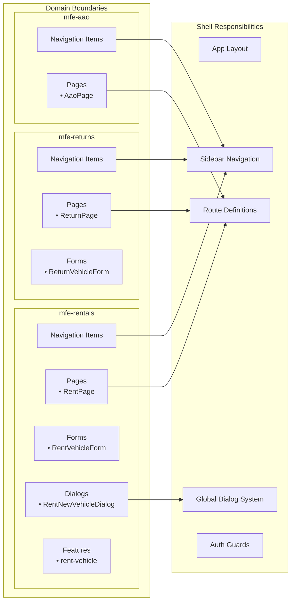
```mermaid
flowchart LR
    subgraph "Domain Boundaries"
        direction TB

        subgraph RENTALS["mfe-rentals"]
            R_NAV["Navigation Items"]
            R_PAGES["Pages<br/>• RentPage"]
            R_FORMS["Forms<br/>• RentVehicleForm"]
            R_DIALOGS["Dialogs<br/>• RentNewVehicleDialog"]
            R_FEATURES["Features<br/>• rent-vehicle"]
        end

        subgraph RETURNS["mfe-returns"]
            RT_NAV["Navigation Items"]
            RT_PAGES["Pages<br/>• ReturnPage"]
            RT_FORMS["Forms<br/>• ReturnVehicleForm"]
        end

        subgraph AAO["mfe-aao"]
            A_NAV["Navigation Items"]
            A_PAGES["Pages<br/>• AaoPage"]
        end
    end

    subgraph "Shell Responsibilities"
        LAYOUT["App Layout"]
        SIDEBAR["Sidebar Navigation"]
        GLOBAL_DIALOG["Global Dialog System"]
        ROUTING["Route Definitions"]
        AUTH["Auth Guards"]
    end

    R_NAV --> SIDEBAR
    RT_NAV --> SIDEBAR
    A_NAV --> SIDEBAR

    R_DIALOGS --> GLOBAL_DIALOG

    R_PAGES --> ROUTING
    RT_PAGES --> ROUTING
    A_PAGES --> ROUTING
```

#### Package Responsibilities

| Package | Responsibility | Exports |
|---------|---------------|---------|
| `@dash/mfe-types` | TypeScript contracts for MFE communication | `NavigationGroup`, `NavigationItem`, `DialogDefinition` |
| `@dash/shared-ui` | Reusable UI components | `Button`, `Card`, `Dialog`, `Input`, `Form`, `Table` |
| `@dash/shared-utils` | Utility functions | `cn()`, `http()` |
| `@dash/shared-state` | Cross-cutting state | `useAuthStore`, `queryClient`, `queryKeys` |
| `@dash/mfe-rentals` | Rentals business domain | `navigation`, `dialogs`, `RentPage`, forms |
| `@dash/mfe-returns` | Returns business domain | `navigation`, `ReturnPage`, forms |
| `@dash/mfe-aao` | AAO business domain | `navigation`, `AaoPage` |
| `@dash/shell` | Application shell | Routes, layout, MFE registry |

### 4.3 Team Ownership Model

The micro-frontend architecture enables clear team ownership with well-defined boundaries. Each team owns specific packages and is responsible for their development, testing, and maintenance.

#### Team Structure

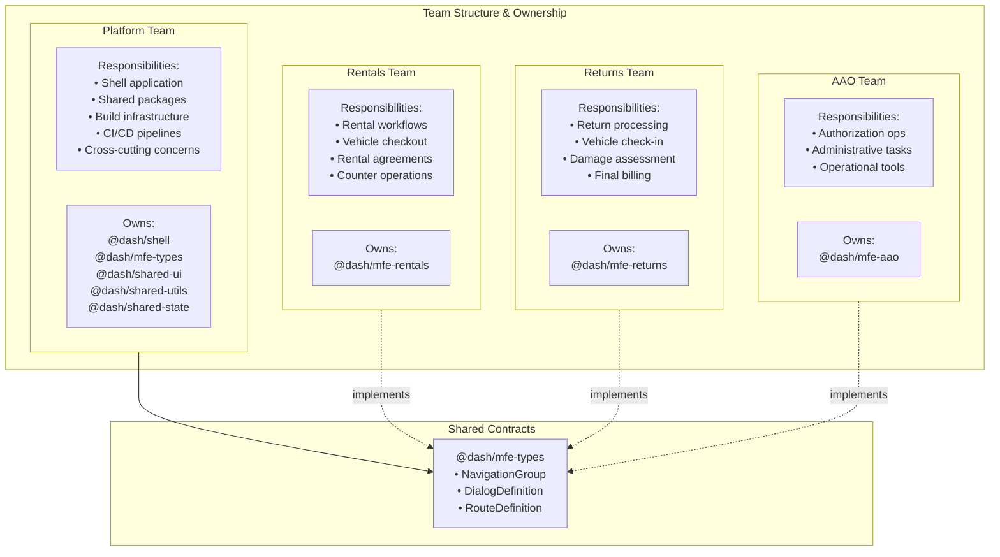
```mermaid
flowchart TB
    subgraph "Team Structure & Ownership"
        direction TB

        subgraph PLATFORM["Platform Team"]
            PT_DESC["Responsibilities:<br/>• Shell application<br/>• Shared packages<br/>• Build infrastructure<br/>• CI/CD pipelines<br/>• Cross-cutting concerns"]
            PT_PACKAGES["Owns:<br/>@dash/shell<br/>@dash/mfe-types<br/>@dash/shared-ui<br/>@dash/shared-utils<br/>@dash/shared-state"]
        end

        subgraph RENTALS_TEAM["Rentals Team"]
            RT_DESC["Responsibilities:<br/>• Rental workflows<br/>• Vehicle checkout<br/>• Rental agreements<br/>• Counter operations"]
            RT_PACKAGES["Owns:<br/>@dash/mfe-rentals"]
        end

        subgraph RETURNS_TEAM["Returns Team"]
            RET_DESC["Responsibilities:<br/>• Return processing<br/>• Vehicle check-in<br/>• Damage assessment<br/>• Final billing"]
            RET_PACKAGES["Owns:<br/>@dash/mfe-returns"]
        end

        subgraph AAO_TEAM["AAO Team"]
            AAO_DESC["Responsibilities:<br/>• Authorization ops<br/>• Administrative tasks<br/>• Operational tools"]
            AAO_PACKAGES["Owns:<br/>@dash/mfe-aao"]
        end
    end

    subgraph "Shared Contracts"
        CONTRACTS["@dash/mfe-types<br/>• NavigationGroup<br/>• DialogDefinition<br/>• RouteDefinition"]
    end

    PLATFORM --> CONTRACTS
    RENTALS_TEAM -.->|"implements"| CONTRACTS
    RETURNS_TEAM -.->|"implements"| CONTRACTS
    AAO_TEAM -.->|"implements"| CONTRACTS
```

#### Ownership Matrix

| Package | Owner Team | Responsibilities | Approval Required From |
|---------|------------|------------------|----------------------|
| `@dash/shell` | Platform | App shell, routing, layout, MFE integration | Platform Lead |
| `@dash/mfe-types` | Platform | TypeScript contracts, breaking change management | Platform Lead + All MFE Teams |
| `@dash/shared-ui` | Platform | UI components, design system, accessibility | Platform Lead |
| `@dash/shared-utils` | Platform | Utilities, HTTP client, helpers | Platform Lead |
| `@dash/shared-state` | Platform | Auth, query client, global state | Platform Lead |
| `@dash/mfe-rentals` | Rentals | Rental pages, forms, dialogs, features | Rentals Lead |
| `@dash/mfe-returns` | Returns | Return pages, forms, features | Returns Lead |
| `@dash/mfe-aao` | AAO | AAO pages, features | AAO Lead |

#### CODEOWNERS Configuration

Create `.github/CODEOWNERS` to enforce code review requirements:

```plaintext
# Default owner for everything
* @dash/platform-team

# Shell application
/apps/shell/ @dash/platform-team

# Shared packages (Platform team owns, changes need review)
/packages/mfe-types/ @dash/platform-team
/packages/shared-ui/ @dash/platform-team
/packages/shared-utils/ @dash/platform-team
/packages/shared-state/ @dash/platform-team

# MFE packages (respective teams own)
/packages/mfe-rentals/ @dash/rentals-team
/packages/mfe-returns/ @dash/returns-team
/packages/mfe-aao/ @dash/aao-team

# Breaking changes to contracts require all teams
/packages/mfe-types/src/navigation.ts @dash/platform-team @dash/rentals-team @dash/returns-team @dash/aao-team
/packages/mfe-types/src/dialog.ts @dash/platform-team @dash/rentals-team @dash/returns-team @dash/aao-team

# CI/CD and build configuration
/.github/ @dash/platform-team
/turbo.json @dash/platform-team
/pnpm-workspace.yaml @dash/platform-team
```

#### Team Boundaries & Communication

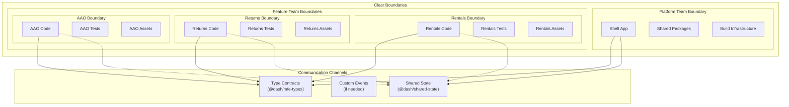
```mermaid
flowchart TB
    subgraph "Clear Boundaries"
        direction LR

        subgraph "Platform Team Boundary"
            SHELL["Shell App"]
            SHARED["Shared Packages"]
            INFRA["Build Infrastructure"]
        end

        subgraph "Feature Team Boundaries"
            subgraph "Rentals Boundary"
                RENT_CODE["Rentals Code"]
                RENT_TESTS["Rentals Tests"]
                RENT_ASSETS["Rentals Assets"]
            end

            subgraph "Returns Boundary"
                RET_CODE["Returns Code"]
                RET_TESTS["Returns Tests"]
                RET_ASSETS["Returns Assets"]
            end

            subgraph "AAO Boundary"
                AAO_CODE["AAO Code"]
                AAO_TESTS["AAO Tests"]
                AAO_ASSETS["AAO Assets"]
            end
        end
    end

    subgraph "Communication Channels"
        CONTRACTS["Type Contracts<br/>(@dash/mfe-types)"]
        EVENTS["Custom Events<br/>(if needed)"]
        STATE["Shared State<br/>(@dash/shared-state)"]
    end

    RENT_CODE --> CONTRACTS
    RET_CODE --> CONTRACTS
    AAO_CODE --> CONTRACTS

    SHELL --> CONTRACTS
    SHELL --> STATE

    RENT_CODE -.-> STATE
    RET_CODE -.-> STATE
    AAO_CODE -.-> STATE
```

#### Dependency Rules

Teams must follow these dependency rules to maintain clear boundaries:

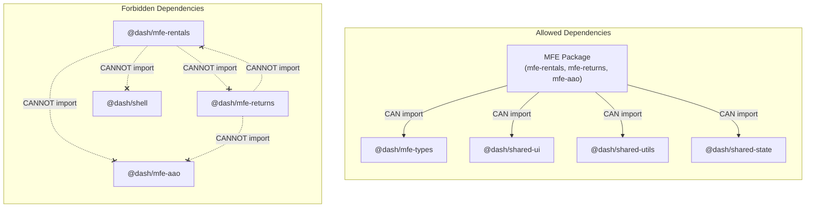
```mermaid
flowchart TD
    subgraph "Allowed Dependencies"
        direction TB

        MFE["MFE Package<br/>(mfe-rentals, mfe-returns, mfe-aao)"]
        TYPES["@dash/mfe-types"]
        UI["@dash/shared-ui"]
        UTILS["@dash/shared-utils"]
        STATE["@dash/shared-state"]

        MFE -->|"CAN import"| TYPES
        MFE -->|"CAN import"| UI
        MFE -->|"CAN import"| UTILS
        MFE -->|"CAN import"| STATE
    end

    subgraph "Forbidden Dependencies"
        direction TB

        MFE_A["@dash/mfe-rentals"]
        MFE_B["@dash/mfe-returns"]
        MFE_C["@dash/mfe-aao"]
        SHELL_PKG["@dash/shell"]

        MFE_A -.-x|"CANNOT import"| MFE_B
        MFE_A -.-x|"CANNOT import"| MFE_C
        MFE_B -.-x|"CANNOT import"| MFE_A
        MFE_B -.-x|"CANNOT import"| MFE_C
        MFE_A -.-x|"CANNOT import"| SHELL_PKG
    end
```

**Dependency Rules:**

| Rule | Description | Rationale |
|------|-------------|-----------|
| MFEs cannot import other MFEs | `mfe-rentals` cannot import from `mfe-returns` | Prevents coupling between domains |
| MFEs cannot import shell | `mfe-rentals` cannot import from `@dash/shell` | Shell is the consumer, not a dependency |
| MFEs can only import shared packages | Only `mfe-types`, `shared-ui`, `shared-utils`, `shared-state` | Ensures all cross-cutting code goes through contracts |
| Shared packages cannot import MFEs | `shared-ui` cannot import from `mfe-rentals` | Prevents circular dependencies |

#### Integration Points & Contracts

Teams communicate through well-defined contracts:

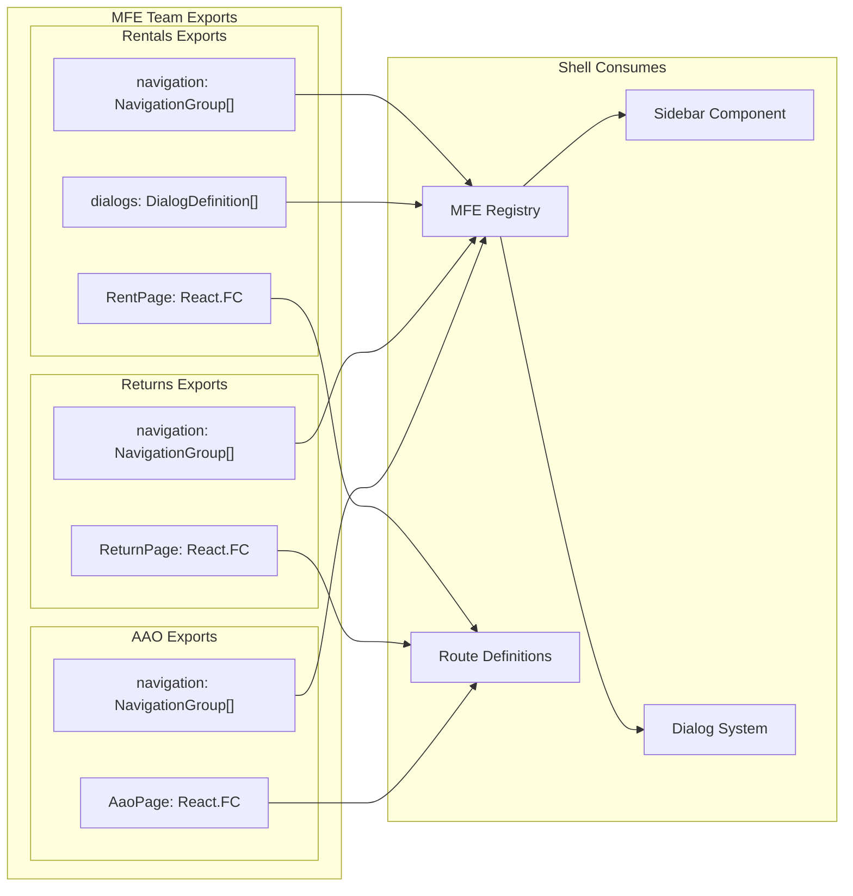
```mermaid
flowchart LR
    subgraph "MFE Team Exports"
        direction TB

        subgraph "Rentals Exports"
            R_NAV["navigation: NavigationGroup[]"]
            R_DIALOGS["dialogs: DialogDefinition[]"]
            R_PAGES["RentPage: React.FC"]
        end

        subgraph "Returns Exports"
            RT_NAV["navigation: NavigationGroup[]"]
            RT_PAGES["ReturnPage: React.FC"]
        end

        subgraph "AAO Exports"
            A_NAV["navigation: NavigationGroup[]"]
            A_PAGES["AaoPage: React.FC"]
        end
    end

    subgraph "Shell Consumes"
        REGISTRY["MFE Registry"]
        ROUTES["Route Definitions"]
        SIDEBAR["Sidebar Component"]
        DIALOG_SYS["Dialog System"]
    end

    R_NAV --> REGISTRY
    R_DIALOGS --> REGISTRY
    R_PAGES --> ROUTES

    RT_NAV --> REGISTRY
    RT_PAGES --> ROUTES

    A_NAV --> REGISTRY
    A_PAGES --> ROUTES

    REGISTRY --> SIDEBAR
    REGISTRY --> DIALOG_SYS
```

#### Team Workflow Example

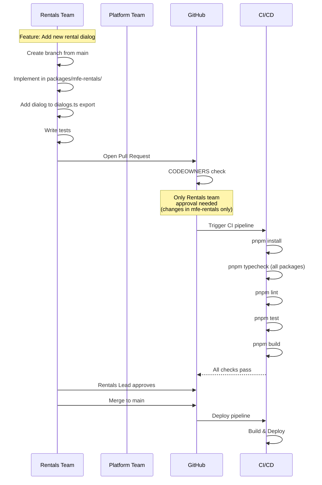
```mermaid
sequenceDiagram
    participant RT as Rentals Team
    participant PT as Platform Team
    participant GH as GitHub
    participant CI as CI/CD

    Note over RT: Feature: Add new rental dialog

    RT->>RT: Create branch from main
    RT->>RT: Implement in packages/mfe-rentals/
    RT->>RT: Add dialog to dialogs.ts export
    RT->>RT: Write tests

    RT->>GH: Open Pull Request

    GH->>GH: CODEOWNERS check
    Note over GH: Only Rentals team<br/>approval needed<br/>(changes in mfe-rentals only)

    GH->>CI: Trigger CI pipeline
    CI->>CI: pnpm install
    CI->>CI: pnpm typecheck (all packages)
    CI->>CI: pnpm lint
    CI->>CI: pnpm test
    CI->>CI: pnpm build

    CI-->>GH: All checks pass

    RT->>GH: Rentals Lead approves
    RT->>GH: Merge to main

    GH->>CI: Deploy pipeline
    CI->>CI: Build & Deploy
```

#### Cross-Team Collaboration Scenarios

**Scenario 1: Adding a new shared component**

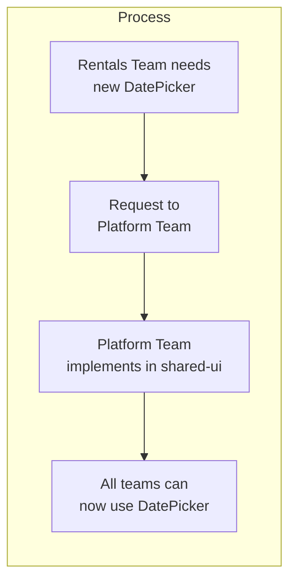
```mermaid
flowchart LR
    subgraph "Process"
        A["Rentals Team needs<br/>new DatePicker"] --> B["Request to<br/>Platform Team"]
        B --> C["Platform Team<br/>implements in shared-ui"]
        C --> D["All teams can<br/>now use DatePicker"]
    end
```

**Scenario 2: Breaking change to contracts**

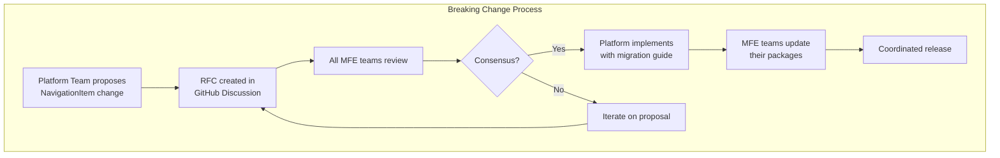
```mermaid
flowchart TB
    subgraph "Breaking Change Process"
        A["Platform Team proposes<br/>NavigationItem change"] --> B["RFC created in<br/>GitHub Discussion"]
        B --> C["All MFE teams review"]
        C --> D{"Consensus?"}
        D -->|Yes| E["Platform implements<br/>with migration guide"]
        D -->|No| F["Iterate on proposal"]
        F --> B
        E --> G["MFE teams update<br/>their packages"]
        G --> H["Coordinated release"]
    end
```

**Scenario 3: Shared state changes**

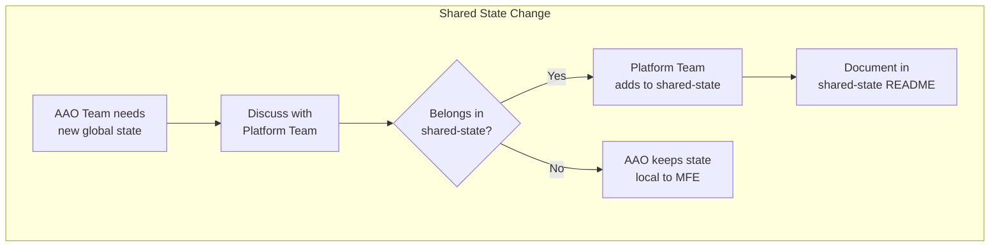
```mermaid
flowchart TB
    subgraph "Shared State Change"
        A["AAO Team needs<br/>new global state"] --> B["Discuss with<br/>Platform Team"]
        B --> C{"Belongs in<br/>shared-state?"}
        C -->|Yes| D["Platform Team<br/>adds to shared-state"]
        C -->|No| E["AAO keeps state<br/>local to MFE"]
        D --> F["Document in<br/>shared-state README"]
    end
```

#### Team Autonomy Benefits

| Benefit | Description |
|---------|-------------|
| **Independent Development** | Teams can develop features without coordinating code merges |
| **Isolated Testing** | Each MFE can be tested independently with mocked shared dependencies |
| **Clear Ownership** | CODEOWNERS ensures right people review changes |
| **Reduced Conflicts** | Teams work in separate directories, minimizing merge conflicts |
| **Faster Onboarding** | New team members only need to understand their MFE |
| **Technology Flexibility** | Teams can experiment within their boundary (same React version required) |
| **Independent Releases** | Teams can merge when ready (deployment still coordinated) |

### 4.4 MFE Registry System

The shell uses a registry pattern for dynamic MFE composition:

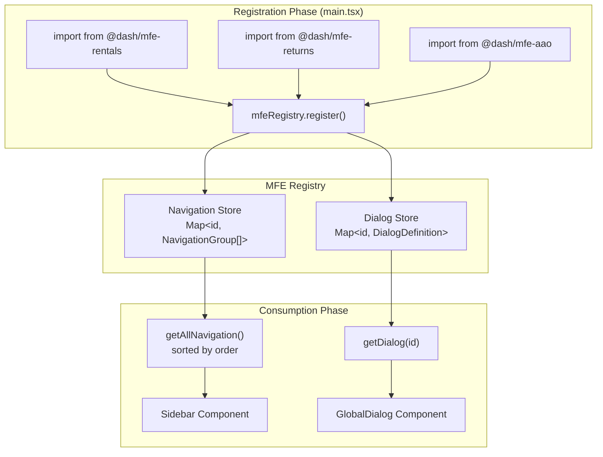
```mermaid
flowchart TB
    subgraph "Registration Phase (main.tsx)"
        IMPORT1["import from @dash/mfe-rentals"]
        IMPORT2["import from @dash/mfe-returns"]
        IMPORT3["import from @dash/mfe-aao"]

        REG["mfeRegistry.register()"]

        IMPORT1 --> REG
        IMPORT2 --> REG
        IMPORT3 --> REG
    end

    subgraph "MFE Registry"
        NAV_STORE["Navigation Store<br/>Map&lt;id, NavigationGroup[]&gt;"]
        DIALOG_STORE["Dialog Store<br/>Map&lt;id, DialogDefinition&gt;"]
    end

    REG --> NAV_STORE
    REG --> DIALOG_STORE

    subgraph "Consumption Phase"
        SIDEBAR["Sidebar Component"]
        GLOBAL_DIALOG["GlobalDialog Component"]

        GET_NAV["getAllNavigation()<br/>sorted by order"]
        GET_DIALOG["getDialog(id)"]
    end

    NAV_STORE --> GET_NAV --> SIDEBAR
    DIALOG_STORE --> GET_DIALOG --> GLOBAL_DIALOG
```

### 4.4 Build Process

The build process uses Turborepo to orchestrate builds across all packages with intelligent caching:

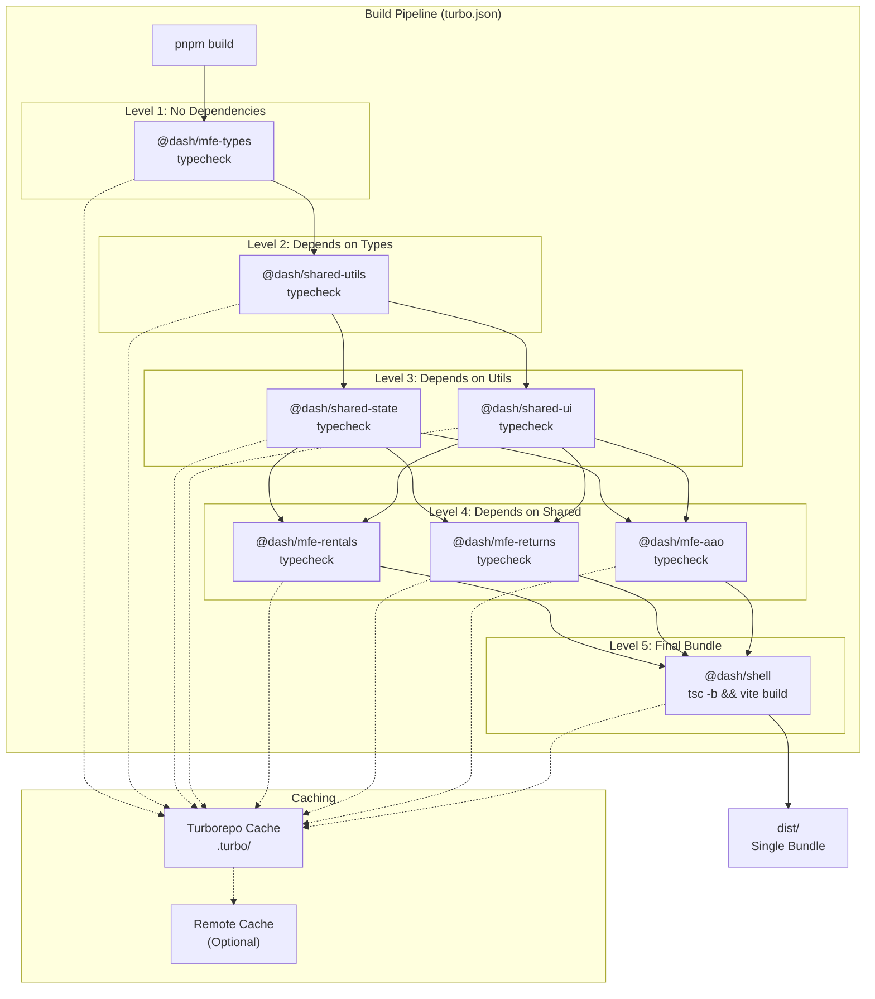
```mermaid
flowchart TB
    subgraph "Build Pipeline (turbo.json)"
        direction TB

        START["pnpm build"]

        subgraph "Level 1: No Dependencies"
            BUILD_TYPES["@dash/mfe-types<br/>typecheck"]
        end

        subgraph "Level 2: Depends on Types"
            BUILD_UTILS["@dash/shared-utils<br/>typecheck"]
        end

        subgraph "Level 3: Depends on Utils"
            BUILD_STATE["@dash/shared-state<br/>typecheck"]
            BUILD_UI["@dash/shared-ui<br/>typecheck"]
        end

        subgraph "Level 4: Depends on Shared"
            BUILD_RENTALS["@dash/mfe-rentals<br/>typecheck"]
            BUILD_RETURNS["@dash/mfe-returns<br/>typecheck"]
            BUILD_AAO["@dash/mfe-aao<br/>typecheck"]
        end

        subgraph "Level 5: Final Bundle"
            BUILD_SHELL["@dash/shell<br/>tsc -b && vite build"]
        end

        START --> BUILD_TYPES
        BUILD_TYPES --> BUILD_UTILS
        BUILD_UTILS --> BUILD_STATE
        BUILD_UTILS --> BUILD_UI
        BUILD_STATE --> BUILD_RENTALS
        BUILD_STATE --> BUILD_RETURNS
        BUILD_STATE --> BUILD_AAO
        BUILD_UI --> BUILD_RENTALS
        BUILD_UI --> BUILD_RETURNS
        BUILD_UI --> BUILD_AAO
        BUILD_RENTALS --> BUILD_SHELL
        BUILD_RETURNS --> BUILD_SHELL
        BUILD_AAO --> BUILD_SHELL
    end

    subgraph "Caching"
        CACHE["Turborepo Cache<br/>.turbo/"]
        REMOTE["Remote Cache<br/>(Optional)"]
    end

    BUILD_SHELL --> OUTPUT["dist/<br/>Single Bundle"]

    BUILD_TYPES -.-> CACHE
    BUILD_UTILS -.-> CACHE
    BUILD_STATE -.-> CACHE
    BUILD_UI -.-> CACHE
    BUILD_RENTALS -.-> CACHE
    BUILD_RETURNS -.-> CACHE
    BUILD_AAO -.-> CACHE
    BUILD_SHELL -.-> CACHE
    CACHE -.-> REMOTE
```

#### Build Commands

```bash
# Full build with dependency resolution
pnpm build

# Build specific package
pnpm --filter @dash/mfe-rentals build

# Dry run to see what would be built
pnpm turbo build --dry-run

# Build with remote caching (CI)
pnpm turbo build --team=<team> --token=<token>
```

### 4.5 CI/CD Deployment Process

Example deployment pipeline using GitHub Actions:

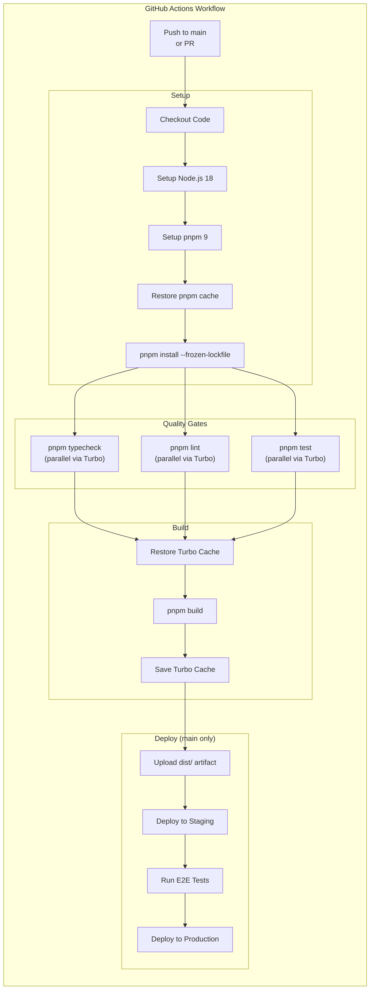
```mermaid
flowchart TB
    subgraph "GitHub Actions Workflow"
        direction TB

        TRIGGER["Push to main<br/>or PR"]

        subgraph "Setup"
            CHECKOUT["Checkout Code"]
            SETUP_NODE["Setup Node.js 18"]
            SETUP_PNPM["Setup pnpm 9"]
            CACHE_DEPS["Restore pnpm cache"]
            INSTALL["pnpm install --frozen-lockfile"]
        end

        subgraph "Quality Gates"
            TYPECHECK["pnpm typecheck<br/>(parallel via Turbo)"]
            LINT["pnpm lint<br/>(parallel via Turbo)"]
            TEST["pnpm test<br/>(parallel via Turbo)"]
        end

        subgraph "Build"
            TURBO_CACHE["Restore Turbo Cache"]
            BUILD["pnpm build"]
            SAVE_CACHE["Save Turbo Cache"]
        end

        subgraph "Deploy (main only)"
            UPLOAD["Upload dist/ artifact"]
            DEPLOY_STAGING["Deploy to Staging"]
            E2E["Run E2E Tests"]
            DEPLOY_PROD["Deploy to Production"]
        end

        TRIGGER --> CHECKOUT
        CHECKOUT --> SETUP_NODE
        SETUP_NODE --> SETUP_PNPM
        SETUP_PNPM --> CACHE_DEPS
        CACHE_DEPS --> INSTALL

        INSTALL --> TYPECHECK
        INSTALL --> LINT
        INSTALL --> TEST

        TYPECHECK --> TURBO_CACHE
        LINT --> TURBO_CACHE
        TEST --> TURBO_CACHE

        TURBO_CACHE --> BUILD
        BUILD --> SAVE_CACHE

        SAVE_CACHE --> UPLOAD
        UPLOAD --> DEPLOY_STAGING
        DEPLOY_STAGING --> E2E
        E2E --> DEPLOY_PROD
    end
```

#### Example GitHub Actions Workflow

```yaml
# .github/workflows/ci.yml
name: CI/CD

on:
  push:
    branches: [main]
  pull_request:
    branches: [main]

env:
  TURBO_TOKEN: ${{ secrets.TURBO_TOKEN }}
  TURBO_TEAM: ${{ vars.TURBO_TEAM }}

jobs:
  build:
    runs-on: ubuntu-latest
    steps:
      - uses: actions/checkout@v4

      - uses: pnpm/action-setup@v2
        with:
          version: 9

      - uses: actions/setup-node@v4
        with:
          node-version: 18
          cache: 'pnpm'

      - name: Install dependencies
        run: pnpm install --frozen-lockfile

      - name: Turbo Cache
        uses: actions/cache@v4
        with:
          path: .turbo
          key: turbo-${{ runner.os }}-${{ github.sha }}
          restore-keys: |
            turbo-${{ runner.os }}-

      - name: Type Check
        run: pnpm typecheck

      - name: Lint
        run: pnpm lint

      - name: Test
        run: pnpm test

      - name: Build
        run: pnpm build

      - name: Upload artifact
        if: github.ref == 'refs/heads/main'
        uses: actions/upload-artifact@v4
        with:
          name: dist
          path: apps/shell/dist

  deploy-staging:
    needs: build
    if: github.ref == 'refs/heads/main'
    runs-on: ubuntu-latest
    environment: staging
    steps:
      - uses: actions/download-artifact@v4
        with:
          name: dist
          path: dist

      # Deploy to staging (example: AWS S3 + CloudFront)
      - name: Deploy to S3
        run: |
          aws s3 sync dist/ s3://${{ vars.S3_BUCKET_STAGING }} --delete
          aws cloudfront create-invalidation --distribution-id ${{ vars.CF_DIST_STAGING }} --paths "/*"

  e2e:
    needs: deploy-staging
    runs-on: ubuntu-latest
    steps:
      - uses: actions/checkout@v4
      - uses: pnpm/action-setup@v2
        with:
          version: 9
      - run: pnpm install --frozen-lockfile
      - run: npx playwright install --with-deps
      - run: pnpm test:e2e
        env:
          BASE_URL: ${{ vars.STAGING_URL }}

  deploy-production:
    needs: e2e
    runs-on: ubuntu-latest
    environment: production
    steps:
      - uses: actions/download-artifact@v4
        with:
          name: dist
          path: dist

      - name: Deploy to Production
        run: |
          aws s3 sync dist/ s3://${{ vars.S3_BUCKET_PROD }} --delete
          aws cloudfront create-invalidation --distribution-id ${{ vars.CF_DIST_PROD }} --paths "/*"
```

### 4.6 Local Development Process

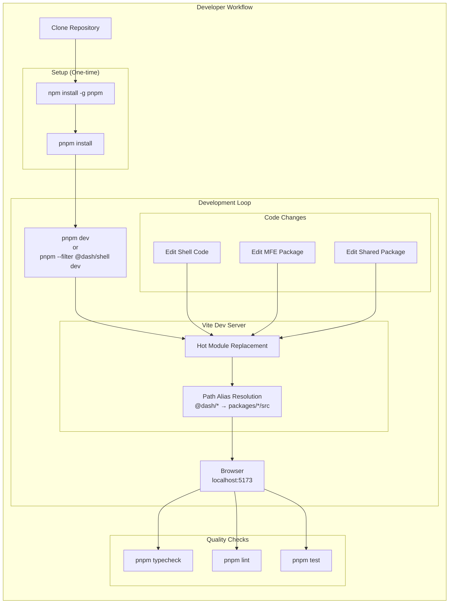
```mermaid
flowchart TB
    subgraph "Developer Workflow"
        direction TB

        START["Clone Repository"]

        subgraph "Setup (One-time)"
            INSTALL_PNPM["npm install -g pnpm"]
            PNPM_INSTALL["pnpm install"]
        end

        subgraph "Development Loop"
            DEV_START["pnpm dev<br/>or<br/>pnpm --filter @dash/shell dev"]

            subgraph "Vite Dev Server"
                HMR["Hot Module Replacement"]
                ALIAS["Path Alias Resolution<br/>@dash/* → packages/*/src"]
            end

            subgraph "Code Changes"
                EDIT_SHELL["Edit Shell Code"]
                EDIT_MFE["Edit MFE Package"]
                EDIT_SHARED["Edit Shared Package"]
            end

            BROWSER["Browser<br/>localhost:5173"]
        end

        subgraph "Quality Checks"
            TYPECHECK["pnpm typecheck"]
            LINT["pnpm lint"]
            TEST["pnpm test"]
        end

        START --> INSTALL_PNPM
        INSTALL_PNPM --> PNPM_INSTALL
        PNPM_INSTALL --> DEV_START

        DEV_START --> HMR
        HMR --> ALIAS
        ALIAS --> BROWSER

        EDIT_SHELL --> HMR
        EDIT_MFE --> HMR
        EDIT_SHARED --> HMR

        BROWSER --> TYPECHECK
        BROWSER --> LINT
        BROWSER --> TEST
    end
```

#### Development Commands

```bash
# Start all packages in watch mode
pnpm dev

# Start only shell (recommended for most development)
pnpm --filter @dash/shell dev

# Run type checking in watch mode
pnpm --filter @dash/shell typecheck --watch

# Run tests in watch mode
pnpm --filter @dash/shell test:watch
```

#### Working on an MFE

1. Make changes in `packages/mfe-{name}/src/`
2. Changes are automatically picked up by Vite's HMR
3. Browser refreshes with updated code
4. No manual rebuild required (source files are directly imported)

#### Adding a New MFE

```bash
# 1. Create package structure
mkdir -p packages/mfe-{name}/src/{pages,features,forms,dialogs}

# 2. Create package.json, tsconfig.json, navigation.ts, index.ts

# 3. Add to shell dependencies
pnpm --filter @dash/shell add @dash/mfe-{name}@workspace:*

# 4. Register in apps/shell/src/main.tsx

# 5. Add route in apps/shell/src/routes/
```

### 4.7 Data Flow

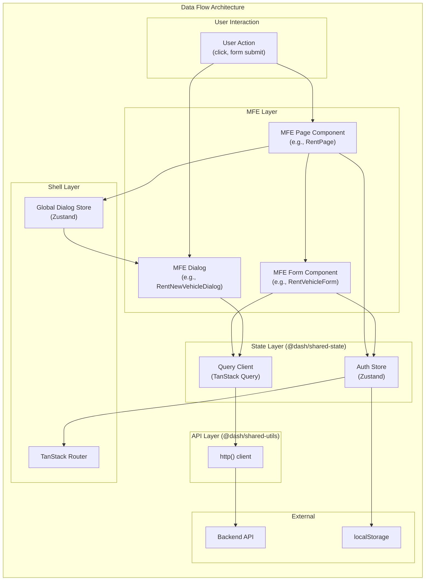
```mermaid
flowchart TB
    subgraph "Data Flow Architecture"
        direction TB

        subgraph "User Interaction"
            USER["User Action<br/>(click, form submit)"]
        end

        subgraph "MFE Layer"
            MFE_PAGE["MFE Page Component<br/>(e.g., RentPage)"]
            MFE_FORM["MFE Form Component<br/>(e.g., RentVehicleForm)"]
            MFE_DIALOG["MFE Dialog<br/>(e.g., RentNewVehicleDialog)"]
        end

        subgraph "State Layer (@dash/shared-state)"
            AUTH_STORE["Auth Store<br/>(Zustand)"]
            QUERY_CLIENT["Query Client<br/>(TanStack Query)"]
        end

        subgraph "Shell Layer"
            GLOBAL_DIALOG_STORE["Global Dialog Store<br/>(Zustand)"]
            ROUTER["TanStack Router"]
        end

        subgraph "API Layer (@dash/shared-utils)"
            HTTP["http() client"]
        end

        subgraph "External"
            API["Backend API"]
            LOCAL_STORAGE["localStorage"]
        end

        USER --> MFE_PAGE
        USER --> MFE_DIALOG

        MFE_PAGE --> MFE_FORM
        MFE_PAGE --> GLOBAL_DIALOG_STORE
        GLOBAL_DIALOG_STORE --> MFE_DIALOG

        MFE_FORM --> QUERY_CLIENT
        MFE_DIALOG --> QUERY_CLIENT

        QUERY_CLIENT --> HTTP
        HTTP --> API

        AUTH_STORE --> LOCAL_STORAGE
        AUTH_STORE --> ROUTER

        MFE_PAGE --> AUTH_STORE
        MFE_FORM --> AUTH_STORE
    end
```

#### State Management Patterns

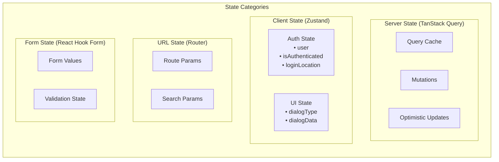
```mermaid
flowchart LR
    subgraph "State Categories"
        direction TB

        subgraph "Server State (TanStack Query)"
            CACHE["Query Cache"]
            MUTATIONS["Mutations"]
            OPTIMISTIC["Optimistic Updates"]
        end

        subgraph "Client State (Zustand)"
            AUTH["Auth State<br/>• user<br/>• isAuthenticated<br/>• loginLocation"]
            UI["UI State<br/>• dialogType<br/>• dialogData"]
        end

        subgraph "URL State (Router)"
            ROUTE["Route Params"]
            SEARCH["Search Params"]
        end

        subgraph "Form State (React Hook Form)"
            FORM["Form Values"]
            VALIDATION["Validation State"]
        end
    end
```

#### Example Data Flow: Rent Vehicle

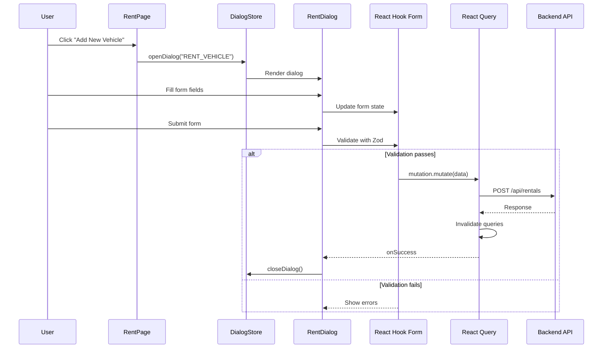
```mermaid
sequenceDiagram
    participant U as User
    participant RP as RentPage
    participant DS as DialogStore
    participant RD as RentDialog
    participant RHF as React Hook Form
    participant RQ as React Query
    participant API as Backend API

    U->>RP: Click "Add New Vehicle"
    RP->>DS: openDialog("RENT_VEHICLE")
    DS->>RD: Render dialog

    U->>RD: Fill form fields
    RD->>RHF: Update form state

    U->>RD: Submit form
    RD->>RHF: Validate with Zod

    alt Validation passes
        RHF->>RQ: mutation.mutate(data)
        RQ->>API: POST /api/rentals
        API-->>RQ: Response
        RQ->>RQ: Invalidate queries
        RQ-->>RD: onSuccess
        RD->>DS: closeDialog()
    else Validation fails
        RHF-->>RD: Show errors
    end
```

---

## 5) High-level diagram

### 5.1 Static/module architecture diagram

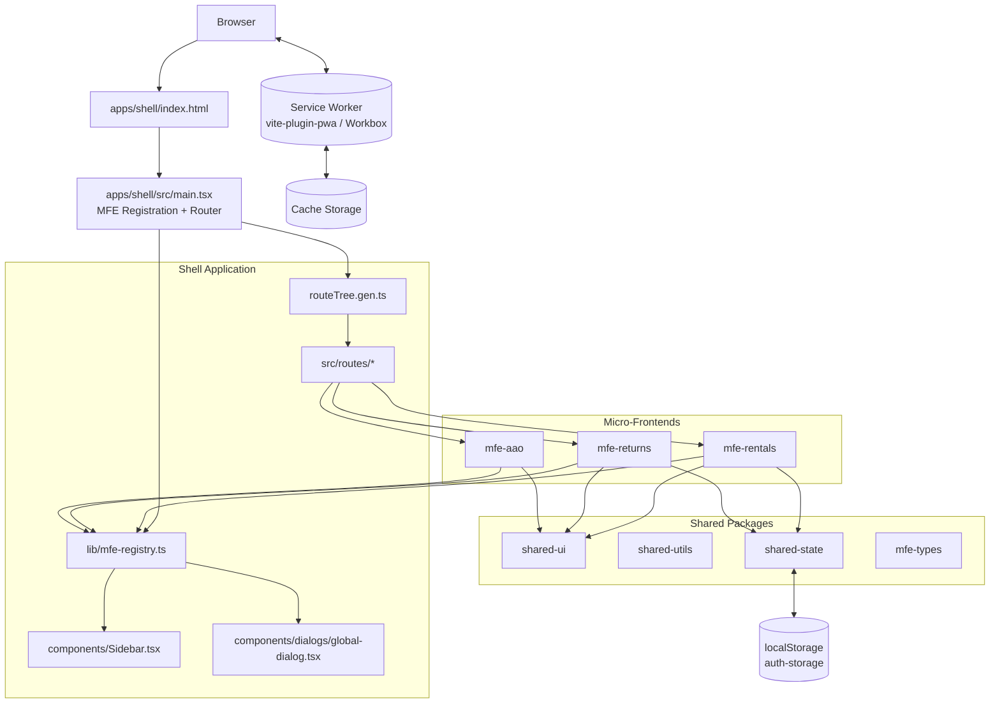
```mermaid
flowchart TB
    Browser[Browser]
    IndexHTML[apps/shell/index.html]
    Main[apps/shell/src/main.tsx<br/>MFE Registration + Router]
    SW[(Service Worker<br/>vite-plugin-pwa / Workbox)]
    Cache[(Cache Storage)]

    subgraph "Shell Application"
        RouteTree[routeTree.gen.ts]
        Routes[src/routes/*]
        Registry[lib/mfe-registry.ts]
        Sidebar[components/Sidebar.tsx]
        GlobalDialog[components/dialogs/global-dialog.tsx]
    end

    subgraph "Shared Packages"
        SharedUI[shared-ui]
        SharedUtils[shared-utils]
        SharedState[shared-state]
        MFETypes[mfe-types]
    end

    subgraph "Micro-Frontends"
        MFERentals[mfe-rentals]
        MFEReturns[mfe-returns]
        MFEAAO[mfe-aao]
    end

    LocalStorage[(localStorage<br/>auth-storage)]

    Browser --> IndexHTML --> Main
    Browser <--> SW
    SW <--> Cache

    Main --> Registry
    Main --> RouteTree
    RouteTree --> Routes

    Registry --> Sidebar
    Registry --> GlobalDialog

    MFERentals --> Registry
    MFEReturns --> Registry
    MFEAAO --> Registry

    Routes --> MFERentals
    Routes --> MFEReturns
    Routes --> MFEAAO

    MFERentals --> SharedUI
    MFERentals --> SharedState
    MFEReturns --> SharedUI
    MFEReturns --> SharedState
    MFEAAO --> SharedUI

    SharedState <--> LocalStorage
```

### 5.2 Authenticated navigation flow (runtime)

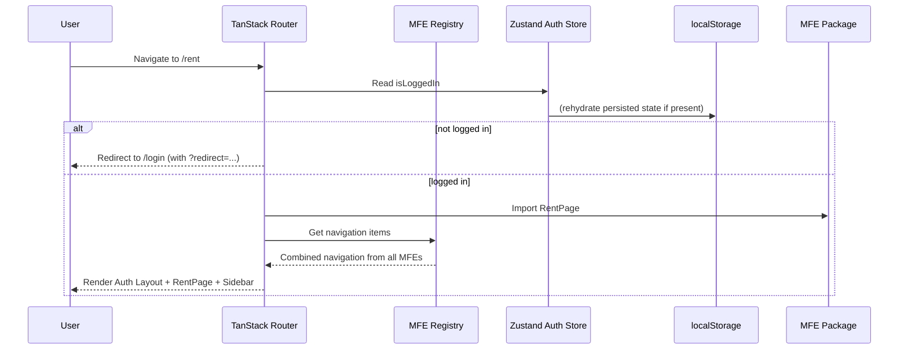
```mermaid
sequenceDiagram
    participant U as User
    participant R as TanStack Router
    participant MR as MFE Registry
    participant S as Zustand Auth Store
    participant LS as localStorage
    participant MFE as MFE Package

    U->>R: Navigate to /rent
    R->>S: Read isLoggedIn
    S->>LS: (rehydrate persisted state if present)

    alt not logged in
        R-->>U: Redirect to /login (with ?redirect=...)
    else logged in
        R->>MFE: Import RentPage
        R->>MR: Get navigation items
        MR-->>R: Combined navigation from all MFEs
        R-->>U: Render Auth Layout + RentPage + Sidebar
    end
```

---

## 6) Current constraints / assumptions

- Build-time composition means all MFEs deploy together (no independent MFE deployments)
- Auth is currently a client-side flag persisted to localStorage
- The architecture intentionally places auth checks in route guards (`beforeLoad`)
- All MFEs share the same version of React and other peer dependencies

---

## 7) Extension points (expected evolution)

### Runtime Module Federation

If independent deployments become necessary, the architecture can evolve to use Vite's Module Federation:

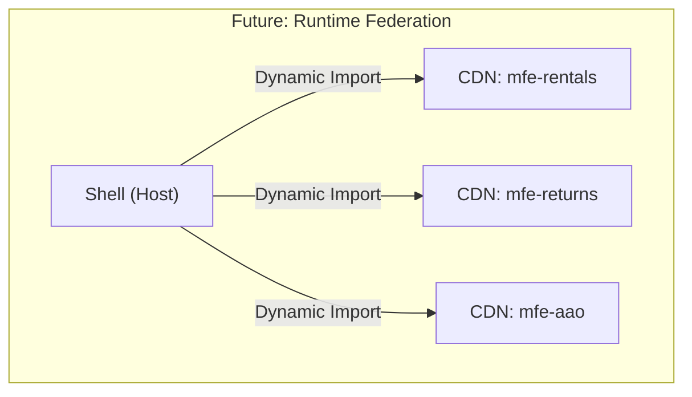
```mermaid
flowchart TB
    subgraph "Future: Runtime Federation"
        SHELL_HOST["Shell (Host)"]

        CDN_RENTALS["CDN: mfe-rentals"]
        CDN_RETURNS["CDN: mfe-returns"]
        CDN_AAO["CDN: mfe-aao"]

        SHELL_HOST -->|"Dynamic Import"| CDN_RENTALS
        SHELL_HOST -->|"Dynamic Import"| CDN_RETURNS
        SHELL_HOST -->|"Dynamic Import"| CDN_AAO
    end
```

### Additional MFEs

New business domains can be added following the established pattern:
- `@dash/mfe-fleet-management` - Fleet and inventory management
- `@dash/mfe-reservations` - Reservation processing
- `@dash/mfe-reporting` - Reports and analytics

### Shared Design Tokens

Extract Tailwind configuration to a shared package for synchronized design tokens:
- `@dash/shared-design` - Colors, typography, spacing, animations

### API Client Module

Introduce a dedicated API client package:
- `@dash/shared-api` - Typed API clients, interceptors, error handling
