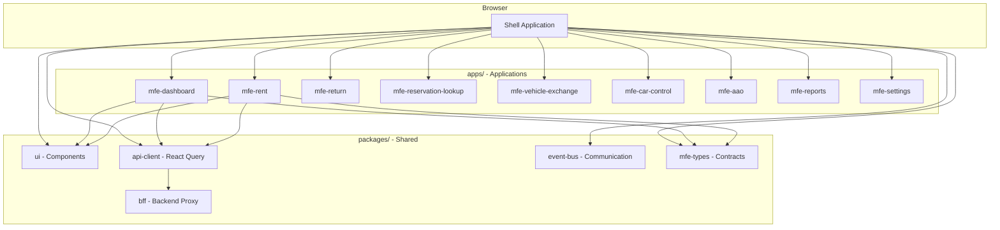
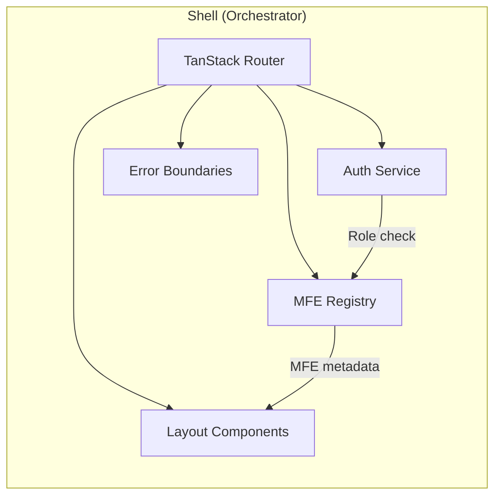
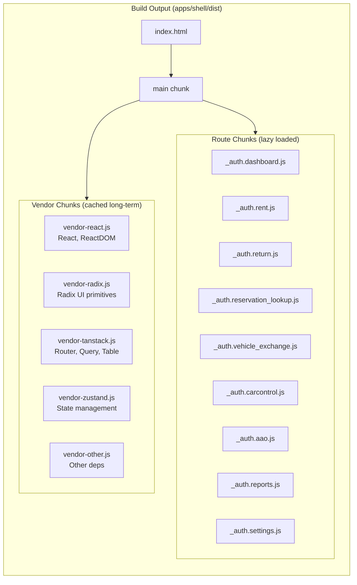
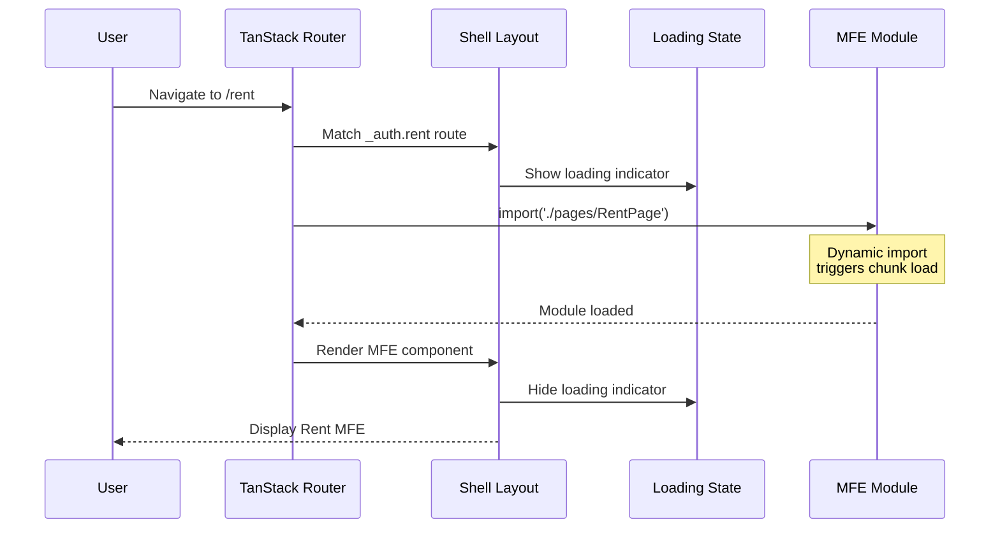
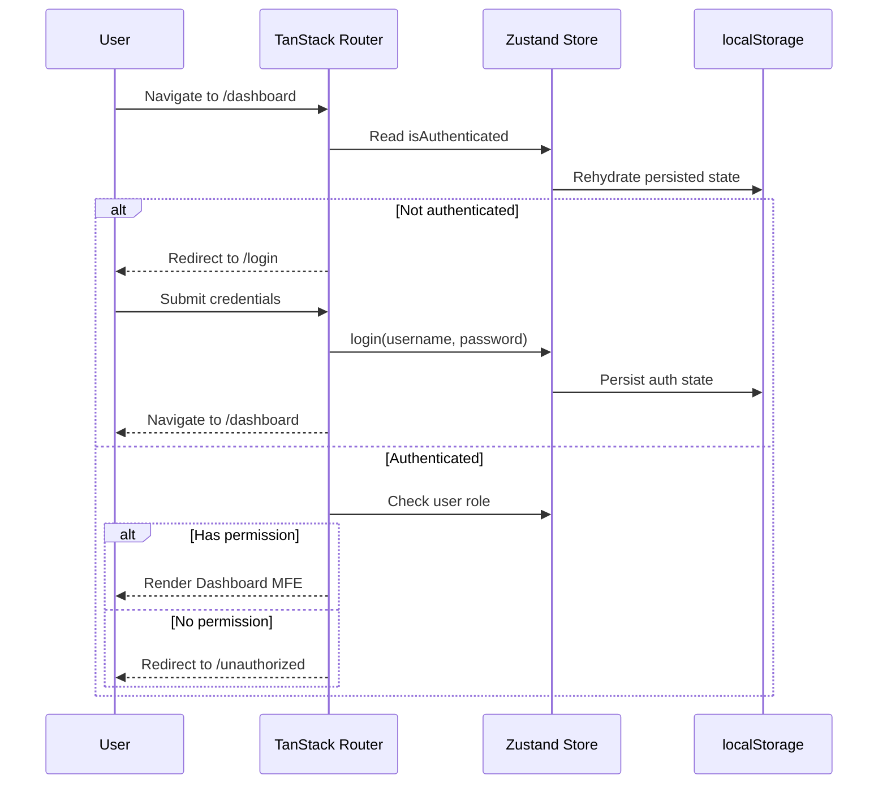
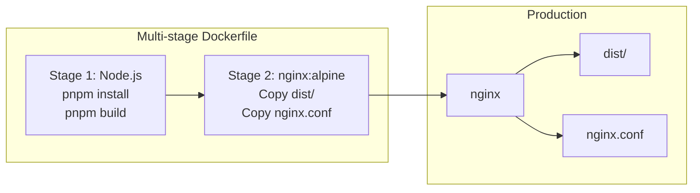
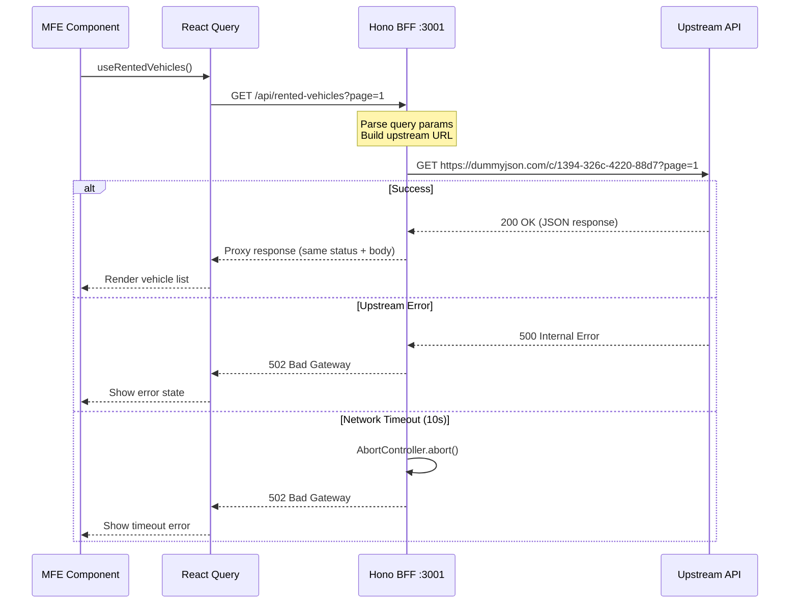
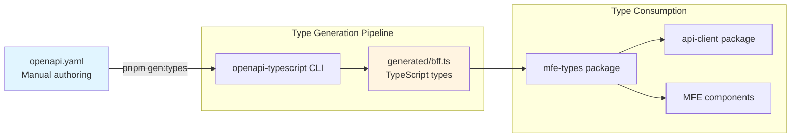

# Architecture (new-dash-ui)

## 1) Purpose / scope

This repository is a **micro-frontend (MFE) dashboard application** built as a pnpm monorepo. It uses **build-time federation** where the shell application bundles all MFEs at build time, producing a single deployable artifact.

The primary goals of the architecture are:

- **Team ownership boundaries** - Each MFE can be developed independently
- **Type-safe contracts** - Shared types ensure compile-time verification
- **Unified deployment** - Single Docker image simplifies operations
- **Lazy loading** - MFEs load on-demand for optimal performance

---

## 2) Project Structure

```
new-dash-ui/
├── apps/
│   ├── shell/                 # Host application (orchestrator)
│   │   ├── src/
│   │   │   ├── routes/        # TanStack Router routes (lazy load MFEs)
│   │   │   ├── services/      # Auth service, MFE registry
│   │   │   ├── store/         # Zustand state (auth, MFE loading)
│   │   │   ├── components/    # Shell-specific components
│   │   │   ├── layout/        # Sidebar, header, footer
│   │   │   └── pages/         # MFE page wrappers
│   │   ├── Dockerfile         # Multi-stage production build
│   │   └── vite.config.ts     # Bundle optimization, chunk splitting
│   ├── mfe-dashboard/         # Dashboard MFE (counter_agent, fleet_manager)
│   ├── mfe-rent/              # Rent workflow MFE (counter_agent)
│   ├── mfe-return/            # Return workflow MFE (counter_agent)
│   ├── mfe-reservation-lookup/# Reservation lookup MFE (counter_agent)
│   ├── mfe-vehicle-exchange/  # Vehicle exchange MFE (counter_agent)
│   ├── mfe-car-control/       # Car control MFE (fleet_manager)
│   ├── mfe-aao/               # AAO MFE (fleet_manager)
│   ├── mfe-reports/           # Reports MFE (system_admin)
│   └── mfe-settings/          # Settings MFE (system_admin)
├── packages/
│   ├── ui/                    # Shared UI components (shadcn/ui style)
│   ├── api-client/            # React Query setup, API hooks
│   ├── event-bus/             # Cross-MFE communication (mitt-based)
│   ├── mfe-types/             # Type contracts (auth, navigation, etc.)
│   │   └── src/
│   │       └── generated/     # Auto-generated types from BFF
│   │           └── bff.ts     # OpenAPI-derived TypeScript types
│   └── bff/                   # Backend-for-Frontend (Hono)
│       ├── src/
│       │   └── index.ts       # Hono server with proxy routes
│       ├── openapi.yaml       # OpenAPI 3.x specification
│       └── package.json       # BFF scripts and dependencies
├── docker/
│   └── nginx.conf             # Production server config (SPA routing)
└── docker-compose.yml         # Local production demo
```

---

## 3) Technologies / language / framework used (and rationale)

### Runtime / language

- **TypeScript**
  - Used across the app for end-to-end type safety and refactorability.
  - Project references enable cross-package type checking.

- **React 19**
  - Component-based UI architecture with a broad ecosystem.
  - React Compiler enabled for automatic optimizations.

### Tooling: build, dev server, bundling

- **Vite**
  - Modern dev server and bundler with fast HMR.
  - TanStack Router plugin enables file-based routing with auto code-splitting.

- **pnpm workspaces**
  - Efficient monorepo package management.
  - Strict dependency isolation (`shamefully-hoist=false`).

- **Progressive Web App (PWA) via `vite-plugin-pwa`**
  - Generates and registers a service worker + web app manifest.
  - `registerType: "autoUpdate"` keeps the app up-to-date.
  - Install UX via `usePWAInstall` hook + `PWAInstallBanner` component.

### Routing

- **TanStack Router**
  - Strong TypeScript support, route-level code splitting.
  - `autoCodeSplitting: true` creates separate chunks per route.
  - Route guards via `beforeLoad` for auth checks.

### State management

- **Zustand** (+ `persist` middleware)
  - Lightweight global state for auth and MFE loading states.
  - Auth state persisted in localStorage.

### Styling / UI system

- **Tailwind CSS v4** - Utility-first styling with CSS-based theme tokens.
- **Radix UI primitives** - Accessible unstyled components.
- **shadcn/ui-style components** - Variant-based reusable UI in `packages/ui`.
- **lucide-react** - Consistent icon set.

### Forms & Validation

- **React Hook Form** for performant form state management.
- **Zod** for schema-driven validation and TypeScript inference.
- Integrated using `@hookform/resolvers/zod`.

### Server State & Data Fetching

- **TanStack Query** (React Query) for server-state management, caching, and background sync.
- Centralized QueryClient in `packages/api-client`.

### Cross-MFE Communication

- **Event Bus** (`packages/event-bus`)
  - Typed events via mitt for loose coupling between MFEs.
  - Events: navigation, data refresh, notifications, auth state changes.

### Quality / testing

- **Vitest** - Unit and component testing.
- **Playwright** - End-to-end testing.
- **ESLint** - Code quality and React best practices.

---

## 4) MFE Architecture

### 4.1 High-level Architecture



### 4.2 Shell Orchestration

The shell application provides:

1. **Authentication** - Login flow, session management, role-based access
2. **Navigation** - Sidebar with role-filtered navigation items
3. **Layout** - Header, sidebar, main content area
4. **MFE Loading** - Lazy loading with loading states and error boundaries
5. **Event Bus** - Centralized cross-MFE communication



### 4.3 Build Output (Code Splitting)

The Vite build produces optimized chunks for caching efficiency:



### 4.4 Lazy Loading Flow



---

## 5) Package Architecture

### 5.1 packages/mfe-types

Shared TypeScript type definitions providing compile-time verification:

| Type | Purpose |
|------|---------|
| `MfeMetadata`, `MfeRegistry` | MFE registration and lifecycle |
| `AuthState`, `AuthService`, `User`, `Role` | Authentication contracts |
| `NavigationItem`, `NavigationGroup` | Navigation structure |
| `DialogDefinition`, `DialogState` | Cross-MFE modal system |
| `generated/bff.ts` | Auto-generated types from BFF OpenAPI spec |

### 5.2 packages/event-bus

Typed event bus for cross-MFE communication using mitt:

| Event | Payload | Purpose |
|-------|---------|---------|
| `navigation:change` | `{ path, state? }` | Request navigation |
| `data:refresh` | `{ entity, id? }` | Trigger data refetch |
| `notification:show` | `{ type, message, duration? }` | Show toast notification |
| `auth:state-changed` | `{ isAuthenticated, user? }` | Auth state broadcast |

### 5.3 packages/ui

Shared UI component library (shadcn/ui style):

- Form components: Button, Input, Label, Select, Checkbox
- Layout: Card, Separator, Dialog, Sheet
- Data display: DataTable, Badge, Avatar
- Utilities: `cn()` helper for class merging

### 5.4 packages/api-client

React Query setup for server state:

- Configured QueryClient with defaults
- Query key factories for consistent caching
- Reusable mutation hooks

---

## 6) Authentication & Authorization

### 6.1 Auth Flow



### 6.2 Role-Based Access

| Role | Access |
|------|--------|
| `counter_agent` | Dashboard, Rent, Return, Reservation Lookup, Vehicle Exchange |
| `fleet_manager` | Dashboard, Car Control, AAO |
| `system_admin` | Reports, Settings |
| `super_admin` | All MFEs |

Route guards enforce role-based access via `beforeLoad`:

```typescript
// apps/shell/src/routes/_auth.rent.tsx
beforeLoad: ({ context }) => {
  const { auth } = context;
  if (!auth.hasAnyRole(['counter_agent', 'super_admin'])) {
    throw redirect({ to: '/unauthorized' });
  }
}
```

---

## 7) Deployment Architecture

### 7.1 Docker Production Build



### 7.2 nginx Configuration

The nginx config handles SPA routing:

- Serves static assets from `/dist`
- Gzip compression for text assets
- Falls back to `index.html` for client-side routing
- Cache headers for vendor chunks (immutable)

### 7.3 Commands

```bash
# Development
pnpm dev                    # Start shell dev server (port 5173)

# Production build
pnpm build                  # Build all packages and shell

# Docker
docker-compose up --build   # Build and run on port 8080
docker-compose down         # Stop containers
```

---

## 8) Development Guide

### 8.1 Adding a New MFE

1. **Create MFE package:**
   ```bash
   mkdir -p apps/mfe-newfeature/src
   ```

2. **Add package.json:**
   ```json
   {
     "name": "@apps/mfe-newfeature",
     "private": true,
     "dependencies": {
       "@packages/ui": "workspace:*",
       "@packages/mfe-types": "workspace:*"
     }
   }
   ```

3. **Create page component in shell:**
   ```bash
   # apps/shell/src/pages/NewFeaturePage.tsx
   ```

4. **Add route:**
   ```bash
   # apps/shell/src/routes/_auth.newfeature.tsx
   ```

5. **Update navigation in shell config**

### 8.2 Shared Package Changes

When modifying `packages/*`:

1. Changes are immediately available in dev mode (pnpm workspace linking)
2. Run `pnpm build` in the package to update compiled output
3. TypeScript project references ensure cross-package type checking

---

## 9) Key Architectural Decisions

| Decision | Rationale |
|----------|-----------|
| Build-time federation | Simpler ops than runtime federation; single deployment artifact |
| Each page = 1 MFE | Clear ownership boundaries; simple mental model |
| Event bus for cross-MFE communication | Prevents tight coupling; typed events ensure correctness |
| Shared types package | Compile-time verification of contracts between shell and MFEs |
| Vendor chunk splitting | Separate cache lifetimes for React, UI libs, etc. |
| TanStack Router auto code-splitting | Route-based lazy loading without manual configuration |
| BFF with OpenAPI-first | Type-safe API contracts; single source of truth for frontend-backend interface |

---

## 10) Testing Strategy

### 10.1 Layers

1. **Unit tests** - Pure functions, utilities (`cn()`, validators)
2. **Component tests** - UI components with React Testing Library
3. **Integration tests** - Route guards, auth flows with mocked stores
4. **E2E tests** - Critical user journeys with Playwright

### 10.2 Commands

```bash
pnpm test              # Run unit/component tests
pnpm test:watch        # Watch mode
pnpm test:coverage     # Coverage report
pnpm test:e2e          # Playwright E2E tests
```

---

## 11) Backend-for-Frontend (BFF) Architecture

### 11.1 Tech Stack

| Technology | Version | Purpose |
|------------|---------|---------|
| **Node.js** | Runtime environment | Executes JavaScript on server-side |
| **Hono** | ^4.0.0 | Lightweight, fast web framework for building the BFF API |
| **@hono/node-server** | ^1.2.0 | Node.js adapter for Hono |
| **TypeScript** | ^5.9.3 | Type-safe development with compile-time checks |
| **tsx** | ^4.21.0 | TypeScript execution and watch mode for development |
| **openapi-typescript** | latest | Generates TypeScript types from OpenAPI specifications |
| **js-yaml** | ^4.1.0 | Parses OpenAPI YAML file and converts to JSON |

### 11.2 Why These Technologies Were Chosen

- **Hono**
  - Ultra-lightweight (~13KB) compared to Express (~200KB)
  - Built with TypeScript-first approach for native type safety
  - Web Standard APIs (Request/Response) make it portable and future-proof
  - Excellent performance for proxy/aggregation use cases
  - Minimal overhead for a thin BFF layer

- **openapi-typescript**
  - Single source of truth for API contracts
  - Automatic TypeScript type generation from OpenAPI specs
  - Eliminates manual type definitions and synchronization issues
  - Ensures frontend-backend type alignment

- **tsx**
  - Fast TypeScript execution without build step in development
  - Hot reload during development
  - Simpler development workflow than ts-node-dev

- **js-yaml**
  - OpenAPI specs are authored in YAML for readability
  - Runtime conversion to JSON for `/openapi.json` endpoint

### 11.3 Overall BFF Architecture

The BFF acts as a **thin proxy and aggregation layer** between the React micro-frontend shell and upstream services.

```mermaid
flowchart TB
    subgraph Frontend["Frontend (React MFE Shell)"]
        MFE[MFE Components]
        RQ[TanStack Query]
        AC[API Client Package]
    end

    subgraph BFF["BFF Layer (Hono)"]
        direction TB
        H[Hono Server :3001]
        R1[/api/rented-vehicles]
        R2[/openapi.json]
        R3[/ - health check]
    end

    subgraph Upstream["Upstream Services"]
        US1[Rented Vehicles API<br/>dummyjson.com]
        US2[Other Services...]
    end

    subgraph TypeGen["Type Generation"]
        YAML[openapi.yaml]
        OAT[openapi-typescript]
        TS[generated/bff.ts]
    end

    MFE --> AC
    AC --> RQ
    RQ -->|HTTP Request| H
    H --> R1
    H --> R2
    H --> R3
    
    R1 -->|Proxy| US1
    R2 -->|Serve spec| YAML
    
    YAML -->|gen:types| OAT
    OAT --> TS
    TS -->|Import types| AC
```

**Integration with React MFE Architecture:**

1. **Shared Type Package** - `packages/mfe-types` contains generated BFF types in `src/generated/bff.ts`
2. **API Client Package** - `packages/api-client` consumes BFF types for React Query hooks
3. **Development Mode** - BFF runs on port 3001 alongside shell on port 5173
4. **Production Mode** - BFF can be deployed separately or bundled based on deployment strategy

### 11.4 Request Flow: Frontend → BFF → Upstream



**Key Flow Characteristics:**

1. **Query Parameter Forwarding** - All query params from frontend are forwarded to upstream
2. **Timeout Protection** - 10-second timeout with AbortController prevents hanging requests
3. **Type-Safe Responses** - Generated types ensure frontend expects correct response shape
4. **Error Handling** - Upstream failures return 502 with descriptive messages
5. **Content-Type Preservation** - Original `content-type` header is maintained in proxy response

### 11.5 Hono Handlers → OpenAPI Mapping

**File Structure:**
```
packages/bff/
├── src/
│   └── index.ts          # Hono routes and handlers
├── openapi.yaml          # OpenAPI 3.x specification
└── package.json          # Scripts and dependencies
```

**OpenAPI Specification (openapi.yaml):**

The OpenAPI spec defines:
- API endpoints (e.g., `/api/rented-vehicles`)
- Request parameters (query, path, body)
- Response schemas (success and error cases)
- Data models and types

**Handler Implementation Pattern:**

```typescript
// From packages/bff/src/index.ts

// 1. Define route matching OpenAPI path
app.get('/api/rented-vehicles', async (c: Context) => {
  
  // 2. Read environment config
  const upstream = process.env.RENTED_VEHICLES_URL ?? 'https://dummyjson.com/...'
  
  // 3. Forward query parameters (type-safe via OpenAPI)
  const upstreamUrl = new URL(upstream)
  for (const [key, value] of Object.entries(c.req.query())) {
    upstreamUrl.searchParams.set(key, value)
  }
  
  // 4. Fetch with timeout protection
  const controller = new AbortController()
  const timeout = setTimeout(() => controller.abort(), 10_000)
  const res = await fetch(upstreamUrl, { signal: controller.signal })
  clearTimeout(timeout)
  
  // 5. Return raw Response (type-safe, matches OpenAPI schema)
  return new Response(await res.text(), {
    status: res.status,
    headers: { 'content-type': res.headers.get('content-type') ?? 'text/plain' }
  })
})
```

**OpenAPI Document Endpoint:**

```typescript
app.get('/openapi.json', async () => {
  const file = await fs.readFile('./openapi.yaml', 'utf8')
  const doc = yaml.load(file)  // Parse YAML to JS object
  return new Response(JSON.stringify(doc), {
    status: 200,
    headers: { 'content-type': 'application/json' }
  })
})
```

This allows frontend tools (Swagger UI, Postman) to introspect the API.

### 11.6 Type Safety Strategy

**Single Source of Truth: OpenAPI Specification**



**Step-by-Step Type Flow:**

1. **Define API Contract** - Edit `packages/bff/openapi.yaml`
   ```yaml
   /api/rented-vehicles:
     get:
       parameters:
         - name: page
           in: query
           schema:
             type: integer
       responses:
         200:
           content:
             application/json:
               schema:
                 $ref: '#/components/schemas/RentedVehiclesResponse'
   ```

2. **Generate Types** - Run `pnpm --filter @packages/bff gen:types`
   ```bash
   # Executes: npx openapi-typescript openapi.yaml \
   #   --output ../mfe-types/src/generated/bff.ts
   ```

3. **Generated TypeScript Output** - `packages/mfe-types/src/generated/bff.ts`
   ```typescript
   export interface paths {
     "/api/rented-vehicles": {
       get: {
         parameters: {
           query?: { page?: number }
         }
         responses: {
           200: {
             content: {
               "application/json": RentedVehiclesResponse
             }
           }
         }
       }
     }
   }
   ```

4. **Consume Types in API Client** - `packages/api-client/src/hooks/useRentedVehicles.ts`
   ```typescript
   import type { paths } from '@packages/mfe-types/generated/bff'
   
   type RentedVehiclesResponse = 
     paths['/api/rented-vehicles']['get']['responses'][200]['content']['application/json']
   
   export const useRentedVehicles = (page: number) => {
     return useQuery<RentedVehiclesResponse>({
       queryKey: ['rented-vehicles', page],
       queryFn: () => fetch(`/api/rented-vehicles?page=${page}`).then(r => r.json())
     })
   }
   ```

**Type Safety Benefits:**

- ✅ **Compile-time verification** - TypeScript catches mismatches before runtime
- ✅ **Auto-completion** - IDEs provide accurate suggestions for API responses
- ✅ **Refactoring safety** - Changing OpenAPI spec shows errors in consuming code
- ✅ **No manual syncing** - Types automatically stay aligned with API contract
- ✅ **Documentation as code** - OpenAPI spec documents and types APIs simultaneously

### 11.7 Running the BFF Server

**Development Mode (Hot Reload):**

```bash
# From project root
pnpm --filter @packages/bff dev

# What it does:
# - Runs: tsx watch src/index.ts
# - Watches for file changes
# - Auto-restarts on changes
# - Server available at: http://localhost:3001
```

**Production Build:**

```bash
# Step 1: Compile TypeScript
pnpm --filter @packages/bff build

# What it does:
# - Runs: tsc -b
# - Outputs compiled JS to: packages/bff/dist/

# Step 2: Start production server
pnpm --filter @packages/bff start

# What it does:
# - Runs: node dist/src/index.js
# - Server available at: http://localhost:3001
```

**Type Generation:**

```bash
# Generate TypeScript types from OpenAPI spec
pnpm --filter @packages/bff gen:types

# What it does:
# - Runs: npx openapi-typescript openapi.yaml \
#         --output ../mfe-types/src/generated/bff.ts \
#         --prettier --silent
# - Reads: packages/bff/openapi.yaml
# - Writes: packages/mfe-types/src/generated/bff.ts
# - Applies Prettier formatting
# - Runs silently (no console output)

# After type generation, rebuild mfe-types package:
pnpm --filter @packages/mfe-types build
```

**Environment Configuration:**

```bash
# Default port: 3001
# Override via environment variable:
PORT=4000 pnpm --filter @packages/bff dev

# Upstream service URL (with fallback):
RENTED_VEHICLES_URL=https://api.example.com/vehicles pnpm dev
```

**Available Endpoints:**

| Endpoint | Method | Purpose |
|----------|--------|---------|
| `/` | GET | Health check - returns "BFF (Hono) is running" |
| `/api/rented-vehicles` | GET | Proxy to rented vehicles upstream API |
| `/openapi.json` | GET | Serves OpenAPI specification (generated from YAML) |

**Testing the BFF:**

```bash
# Health check
curl http://localhost:3001/

# Fetch rented vehicles
curl http://localhost:3001/api/rented-vehicles?page=1

# Get OpenAPI spec
curl http://localhost:3001/openapi.json
```

### 11.8 BFF Integration with MFE Development Workflow

**Typical Development Flow:**

1. **Start BFF server** (terminal 1)
   ```bash
   pnpm --filter @packages/bff dev
   # BFF running on http://localhost:3001
   ```

2. **Start shell application** (terminal 2)
   ```bash
   pnpm --filter @apps/shell dev
   # Shell running on http://localhost:5173
   # Vite proxy configured to forward /api/* to http://localhost:3001
   ```

3. **MFEs make API calls through proxy**
   ```typescript
   // Frontend code (MFE component)
   fetch('/api/rented-vehicles?page=1')
   // → Vite dev server proxies to → http://localhost:3001/api/rented-vehicles?page=1
   // → BFF proxies to → upstream service
   ```

**Vite Proxy Configuration (apps/shell/vite.config.ts):**

```typescript
export default defineConfig({
  server: {
    proxy: {
      '/api': {
        target: 'http://localhost:3001',
        changeOrigin: true
      }
    }
  }
})
```

**Type Generation Workflow:**

1. Update `packages/bff/openapi.yaml`
2. Run `pnpm --filter @packages/bff gen:types`
3. Run `pnpm --filter @packages/mfe-types build`
4. TypeScript compiler in MFEs picks up new types automatically

---

## 12) Related Documentation

- [CONTRACTS.md](docs/CONTRACTS.md) - Event bus events and type definitions
- [README.md](README.md) - Quick start and project overview
- [packages/bff/README.md](packages/bff/README.md) - BFF package-specific documentation