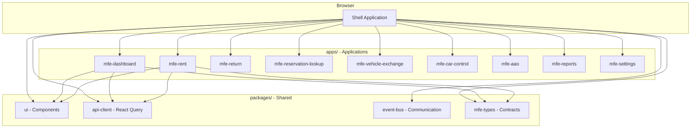
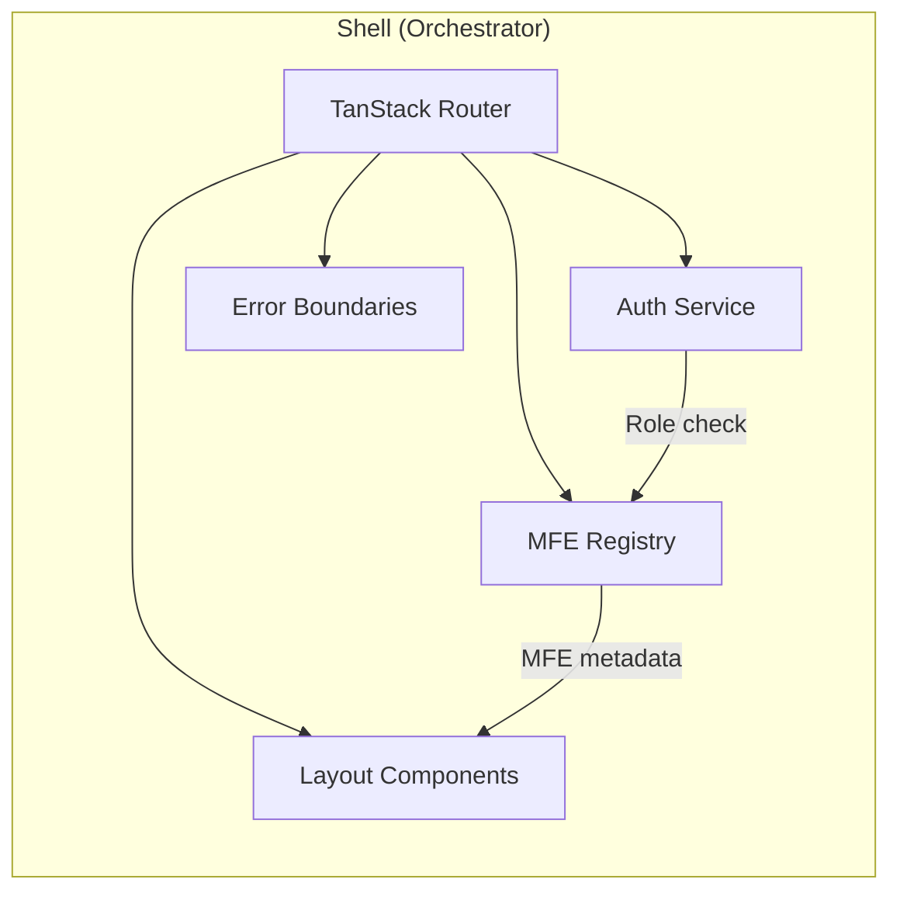
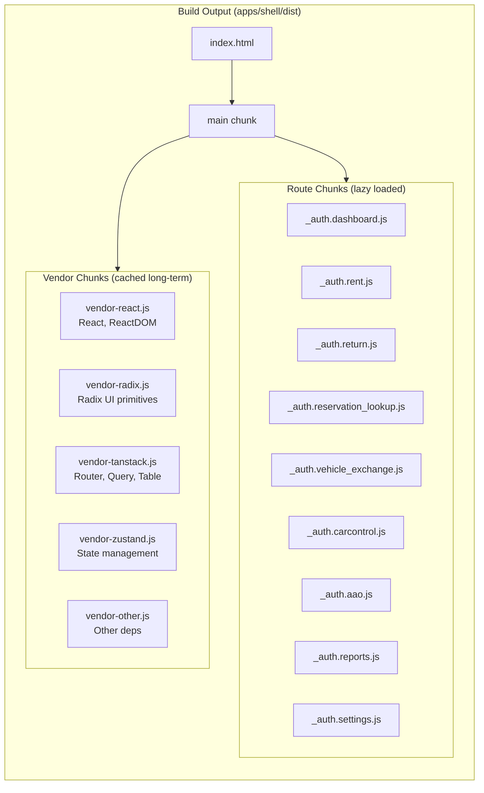
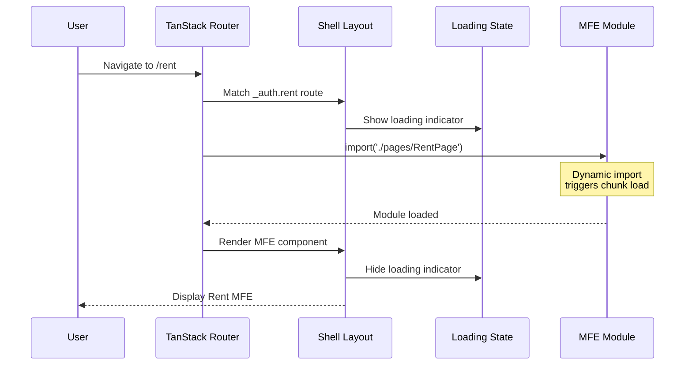
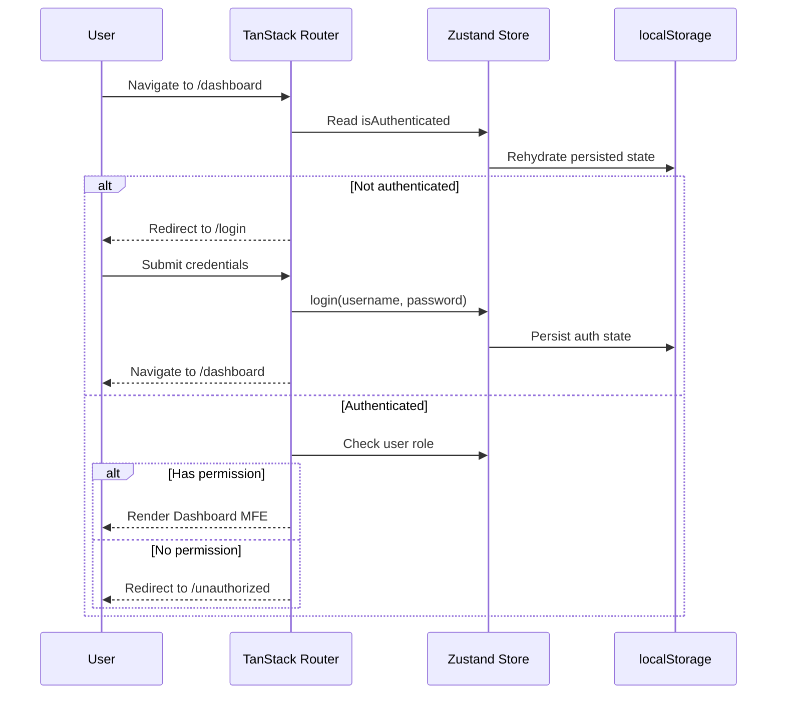
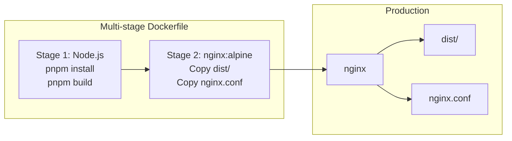

# Architecture (new-dash-ui)

## 1) Purpose / scope

This repository is a **micro-frontend (MFE) dashboard application** built as a pnpm monorepo. It uses **build-time federation** where the shell application bundles all MFEs at build time, producing a single deployable artifact.

The primary goals of the architecture are:

- **Team ownership boundaries** - Each MFE can be developed independently
- **Type-safe contracts** - Shared types ensure compile-time verification
- **Unified deployment** - Single Docker image simplifies operations
- **Lazy loading** - MFEs load on-demand for optimal performance

---

## 2) Project Structure

```
new-dash-ui/
├── apps/
│   ├── shell/                 # Host application (orchestrator)
│   │   ├── src/
│   │   │   ├── routes/        # TanStack Router routes (lazy load MFEs)
│   │   │   ├── services/      # Auth service, MFE registry
│   │   │   ├── store/         # Zustand state (auth, MFE loading)
│   │   │   ├── components/    # Shell-specific components
│   │   │   ├── layout/        # Sidebar, header, footer
│   │   │   └── pages/         # MFE page wrappers
│   │   ├── Dockerfile         # Multi-stage production build
│   │   └── vite.config.ts     # Bundle optimization, chunk splitting
│   ├── mfe-dashboard/         # Dashboard MFE (counter_agent, fleet_manager)
│   ├── mfe-rent/              # Rent workflow MFE (counter_agent)
│   ├── mfe-return/            # Return workflow MFE (counter_agent)
│   ├── mfe-reservation-lookup/# Reservation lookup MFE (counter_agent)
│   ├── mfe-vehicle-exchange/  # Vehicle exchange MFE (counter_agent)
│   ├── mfe-car-control/       # Car control MFE (fleet_manager)
│   ├── mfe-aao/               # AAO MFE (fleet_manager)
│   ├── mfe-reports/           # Reports MFE (system_admin)
│   └── mfe-settings/          # Settings MFE (system_admin)
├── packages/
│   ├── ui/                    # Shared UI components (shadcn/ui style)
│   ├── api-client/            # React Query setup, API hooks
│   ├── event-bus/             # Cross-MFE communication (mitt-based)
│   └── mfe-types/             # Type contracts (auth, navigation, etc.)
├── docker/
│   └── nginx.conf             # Production server config (SPA routing)
└── docker-compose.yml         # Local production demo
```

---

## 3) Technologies / language / framework used (and rationale)

### Runtime / language

- **TypeScript**
  - Used across the app for end-to-end type safety and refactorability.
  - Project references enable cross-package type checking.

- **React 19**
  - Component-based UI architecture with a broad ecosystem.
  - React Compiler enabled for automatic optimizations.

### Tooling: build, dev server, bundling

- **Vite**
  - Modern dev server and bundler with fast HMR.
  - TanStack Router plugin enables file-based routing with auto code-splitting.

- **pnpm workspaces**
  - Efficient monorepo package management.
  - Strict dependency isolation (`shamefully-hoist=false`).

- **Progressive Web App (PWA) via `vite-plugin-pwa`**
  - Generates and registers a service worker + web app manifest.
  - `registerType: "autoUpdate"` keeps the app up-to-date.
  - Install UX via `usePWAInstall` hook + `PWAInstallBanner` component.

### Routing

- **TanStack Router**
  - Strong TypeScript support, route-level code splitting.
  - `autoCodeSplitting: true` creates separate chunks per route.
  - Route guards via `beforeLoad` for auth checks.

### State management

- **Zustand** (+ `persist` middleware)
  - Lightweight global state for auth and MFE loading states.
  - Auth state persisted in localStorage.

### Styling / UI system

- **Tailwind CSS v4** - Utility-first styling with CSS-based theme tokens.
- **Radix UI primitives** - Accessible unstyled components.
- **shadcn/ui-style components** - Variant-based reusable UI in `packages/ui`.
- **lucide-react** - Consistent icon set.

### Forms & Validation

- **React Hook Form** for performant form state management.
- **Zod** for schema-driven validation and TypeScript inference.
- Integrated using `@hookform/resolvers/zod`.

### Server State & Data Fetching

- **TanStack Query** (React Query) for server-state management, caching, and background sync.
- Centralized QueryClient in `packages/api-client`.

### Cross-MFE Communication

- **Event Bus** (`packages/event-bus`)
  - Typed events via mitt for loose coupling between MFEs.
  - Events: navigation, data refresh, notifications, auth state changes.

### Quality / testing

- **Vitest** - Unit and component testing.
- **Playwright** - End-to-end testing.
- **ESLint** - Code quality and React best practices.

---

## 4) MFE Architecture

### 4.1 High-level Architecture



### 4.2 Shell Orchestration

The shell application provides:

1. **Authentication** - Login flow, session management, role-based access
2. **Navigation** - Sidebar with role-filtered navigation items
3. **Layout** - Header, sidebar, main content area
4. **MFE Loading** - Lazy loading with loading states and error boundaries
5. **Event Bus** - Centralized cross-MFE communication



### 4.3 Build Output (Code Splitting)

The Vite build produces optimized chunks for caching efficiency:



### 4.4 Lazy Loading Flow



---

## 5) Package Architecture

### 5.1 packages/mfe-types

Shared TypeScript type definitions providing compile-time verification:

| Type                                       | Purpose                        |
| ------------------------------------------ | ------------------------------ |
| `MfeMetadata`, `MfeRegistry`               | MFE registration and lifecycle |
| `AuthState`, `AuthService`, `User`, `Role` | Authentication contracts       |
| `NavigationItem`, `NavigationGroup`        | Navigation structure           |
| `DialogDefinition`, `DialogState`          | Cross-MFE modal system         |

### 5.2 packages/event-bus

Typed event bus for cross-MFE communication using mitt:

| Event                | Payload                        | Purpose                 |
| -------------------- | ------------------------------ | ----------------------- |
| `navigation:change`  | `{ path, state? }`             | Request navigation      |
| `data:refresh`       | `{ entity, id? }`              | Trigger data refetch    |
| `notification:show`  | `{ type, message, duration? }` | Show toast notification |
| `auth:state-changed` | `{ isAuthenticated, user? }`   | Auth state broadcast    |

### 5.3 packages/ui

Shared UI component library (shadcn/ui style):

- Form components: Button, Input, Label, Select, Checkbox
- Layout: Card, Separator, Dialog, Sheet
- Data display: DataTable, Badge, Avatar
- Utilities: `cn()` helper for class merging

### 5.4 packages/api-client

React Query setup for server state:

- Configured QueryClient with defaults
- Query key factories for consistent caching
- Reusable mutation hooks

---

## 6) Authentication & Authorization

### 6.1 Auth Flow



### 6.2 Role-Based Access

| Role            | Access                                                        |
| --------------- | ------------------------------------------------------------- |
| `counter_agent` | Dashboard, Rent, Return, Reservation Lookup, Vehicle Exchange |
| `fleet_manager` | Dashboard, Car Control, AAO                                   |
| `system_admin`  | Reports, Settings                                             |
| `super_admin`   | All MFEs                                                      |

Route guards enforce role-based access via `beforeLoad`:

```typescript
// apps/shell/src/routes/_auth.rent.tsx
beforeLoad: ({ context }) => {
  const { auth } = context;
  if (!auth.hasAnyRole(['counter_agent', 'super_admin'])) {
    throw redirect({ to: '/unauthorized' });
  }
};
```

---

## 7) Deployment Architecture

### 7.1 Docker Production Build



### 7.2 nginx Configuration

The nginx config handles SPA routing:

- Serves static assets from `/dist`
- Gzip compression for text assets
- Falls back to `index.html` for client-side routing
- Cache headers for vendor chunks (immutable)

### 7.3 Commands

```bash
# Development
pnpm dev                    # Start shell dev server (port 5173)

# Production build
pnpm build                  # Build all packages and shell

# Docker
docker-compose up --build   # Build and run on port 8080
docker-compose down         # Stop containers
```

---

## 8) Development Guide

### 8.1 Adding a New MFE

1. **Create MFE package:**

   ```bash
   mkdir -p apps/mfe-newfeature/src
   ```

2. **Add package.json:**

   ```json
   {
     "name": "@apps/mfe-newfeature",
     "private": true,
     "dependencies": {
       "@packages/ui": "workspace:*",
       "@packages/mfe-types": "workspace:*"
     }
   }
   ```

3. **Create page component in shell:**

   ```bash
   # apps/shell/src/pages/NewFeaturePage.tsx
   ```

4. **Add route:**

   ```bash
   # apps/shell/src/routes/_auth.newfeature.tsx
   ```

5. **Update navigation in shell config**

### 8.2 Shared Package Changes

When modifying `packages/*`:

1. Changes are immediately available in dev mode (pnpm workspace linking)
2. Run `pnpm build` in the package to update compiled output
3. TypeScript project references ensure cross-package type checking

---

## 9) Key Architectural Decisions

| Decision                              | Rationale                                                       |
| ------------------------------------- | --------------------------------------------------------------- |
| Build-time federation                 | Simpler ops than runtime federation; single deployment artifact |
| Each page = 1 MFE                     | Clear ownership boundaries; simple mental model                 |
| Event bus for cross-MFE communication | Prevents tight coupling; typed events ensure correctness        |
| Shared types package                  | Compile-time verification of contracts between shell and MFEs   |
| Vendor chunk splitting                | Separate cache lifetimes for React, UI libs, etc.               |
| TanStack Router auto code-splitting   | Route-based lazy loading without manual configuration           |

---

## 10) Testing Strategy

### 10.1 Layers

1. **Unit tests** - Pure functions, utilities (`cn()`, validators)
2. **Component tests** - UI components with React Testing Library
3. **Integration tests** - Route guards, auth flows with mocked stores
4. **E2E tests** - Critical user journeys with Playwright

### 10.2 Commands

```bash
pnpm test              # Run unit/component tests
pnpm test:watch        # Watch mode
pnpm test:coverage     # Coverage report
pnpm test:e2e          # Playwright E2E tests
```

---

## 11) Related Documentation

- [CONTRACTS.md](docs/CONTRACTS.md) - Event bus events and type definitions
- [README.md](README.md) - Quick start and project overview
